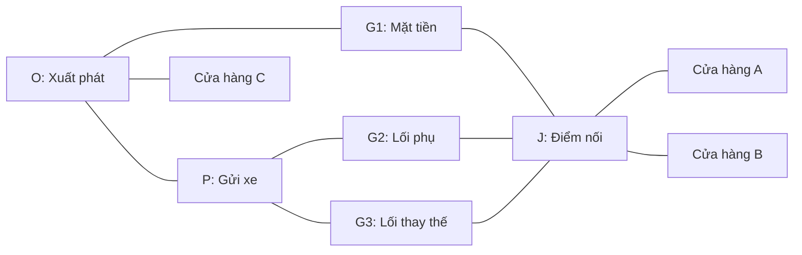

# AccessLink — Kịch bản mock data và hướng chuyển sang dữ liệu thật

**Tên sản phẩm:** LỐI TIẾP CẬN — AccessLink  
**Ngày soạn:** 25/09/2026  
**Mục đích:** Thiết kế và trình bày prototype khi nhóm chưa thể khảo sát thực địa.  
**Phạm vi:** Một khu vực hoàn toàn mô phỏng; không dùng để dẫn đường thực tế.

## 1. Cách sử dụng tài liệu

Tài liệu này bổ sung phương án demo bằng dữ liệu mô phỏng cho proposal AccessLink. Các mục khảo sát và thử nghiệm thực địa trong proposal chính trở thành kế hoạch triển khai tiếp theo, chưa phải việc đã thực hiện.

Mock data cần chứng minh hệ thống có thể đọc thông báo, duyệt cập nhật, kiểm tra điều kiện và tính lại phương án tiếp cận. Dữ liệu mô phỏng không chứng minh người dân đang gặp vấn đề với mức độ nào, hay sản phẩm đã giảm thời gian đi nhầm ngoài thực tế.

Định vị khi thuyết trình:

> “Nhóm xây dựng một môi trường mô phỏng có cấu trúc dữ liệu tương ứng với triển khai thực tế, nhằm kiểm chứng cách hệ thống xử lý thay đổi lối tiếp cận quanh khu thi công.”

## 2. Khu vực mô phỏng

Đặt tên **Khu demo A**, gồm ba cửa hàng, ba lối vào, một điểm gửi xe và một mạng đường nối. Tên địa điểm, điều kiện hoạt động và khoảng cách đều là dữ liệu do nhóm thiết kế.

Có thể trình bày bằng sơ đồ mạng hoặc đặt lớp mô phỏng trên nền bản đồ. Nếu dùng nền bản đồ thật, hiển thị rõ lớp đường nối và quy định là giả định; không gắn cửa hàng thật với thông tin đóng/mở chưa được xác minh. Vị trí minh họa không có ý nghĩa hướng dẫn đi lại.

### Các đối tượng

| Mã | Đối tượng | Thuộc tính mô phỏng | Vai trò |
|---|---|---|---|
| O | Điểm xuất phát trong khu demo | Điểm bắt đầu truy vấn | Cố định đầu vào để kiểm tra kết quả |
| A | Cửa hàng A | Hoạt động 06:00–22:00 | Địa điểm chính để demo |
| B | Cửa hàng B | Hoạt động 06:00–22:00 | Dùng chung mạng tiếp cận với A |
| C | Cửa hàng C | Hoạt động 06:00–22:00, có đường riêng từ O | Kiểm tra địa điểm không bị ảnh hưởng |
| P | Điểm gửi xe | Nhận xe máy 06:00–20:00 | Node chuyển từ xe máy sang đi bộ |
| G1 | Lối mặt tiền | Bị chặn trong trạng thái đầu | Chứng minh không chọn lối gần nhưng đóng |
| G2 | Lối phụ | Cho khách đi bộ | Phương án chính trước khi có thay đổi |
| G3 | Lối phụ thay thế | Cho khách đi bộ, xa hơn G2 | Phương án sau khi G2 đóng |
| J | Điểm nối phía trong | Nối các lối vào tới A và B | Thể hiện quan hệ giữa lối chung và địa điểm |

Trong kịch bản xe máy, chỉ được chuyển sang đi bộ tại P. Không tự giả định khách có thể bỏ xe tại O, trước rào hoặc tại một điểm bất kỳ. Người chọn đi bộ ngay từ đầu được sử dụng mạng đi bộ từ O.

## 3. Mạng đường phải có cấu trúc

### Sơ đồ



Sơ đồ thể hiện kết nối; bảng cạnh và quy tắc quyết định đoạn nào sử dụng được. G1 vẫn xuất hiện trong mạng dù đang bị chặn.

### Bảng cạnh mẫu

| ID | Từ – đến | Phương thức | Chiều dài giả lập | Hướng |
|---|---|---|---:|---|
| e01 | O – P | Xe máy, đi bộ | 100 m | Hai chiều |
| e02 | O – G1 | Đi bộ | 60 m | Hai chiều |
| e03 | G1 – J | Đi bộ | 20 m | Hai chiều |
| e04 | P – G2 | Đi bộ | 40 m | Hai chiều |
| e05 | G2 – J | Đi bộ | 30 m | Hai chiều |
| e06 | P – G3 | Đi bộ | 120 m | Hai chiều |
| e07 | G3 – J | Đi bộ | 60 m | Hai chiều |
| e08 | J – A | Đi bộ | 20 m | Hai chiều |
| e09 | J – B | Đi bộ | 35 m | Hai chiều |
| e10 | O – C | Xe máy, đi bộ | 90 m | Hai chiều |

Khi triển khai, dùng graph này để tính đường. Không viết logic kiểu “bấm nút thì hiển thị tuyến B” hoặc trả về polyline đã vẽ sẵn mà không kiểm tra cạnh và quy tắc.

Khoảng cách trên bảng là fixture phục vụ kiểm thử. Nếu tạo GeoJSON, hình học cần phù hợp với chiều dài hoặc giao diện phải ghi rõ đang dùng chiều dài giả lập. Thời gian di chuyển, nếu hiển thị, tính từ tốc độ và thời gian chuyển phương thức được cấu hình cho mô phỏng; không gọi đó là ETA thực tế.

## 4. Các kịch bản và kết quả mong đợi

Thời gian trong demo sử dụng **đồng hồ mô phỏng**. Không dùng giờ máy hiện tại để vô tình kích hoạt hoặc làm hết hạn toàn bộ fixture. Các khoảng giờ được hiểu là bao gồm thời điểm bắt đầu, không bao gồm thời điểm kết thúc.

### S0 — Trạng thái ban đầu

**Đầu vào:** O → A, xe máy, 17:00 ngày 01/10/2026 theo đồng hồ mô phỏng.

- G1 đóng; G2 và G3 cho đi bộ.
- P còn nhận xe máy.
- A, B và C đang hoạt động trong kịch bản.

**Kết quả:** O → P bằng xe máy; P → G2 → J → A bằng đi bộ. Chặng đi bộ dài 90 m theo fixture. Không sử dụng G1.

**Điều chứng minh:** hệ thống kiểm tra cửa, phương tiện và điểm chuyển sang đi bộ.

### S1 — Một thay đổi tác động nhiều địa điểm

Nhập thông báo giả lập:

> **THÔNG BÁO MÔ PHỎNG — KHÔNG PHẢI VĂN BẢN CƠ QUAN NHÀ NƯỚC**  
> Tại Khu demo A, từ 18:00 ngày 01/10/2026, lối G2 tạm dừng sử dụng đối với người đi bộ theo cả hai chiều. Chưa xác định thời điểm mở lại. Lối G3 tiếp tục dành cho khách đi bộ theo điều kiện hiện có.

Luồng xử lý:

1. AI đề xuất G2, phương thức đi bộ, hai chiều, bắt đầu 18:00, chưa có thời điểm kết thúc.
2. Người vận hành xem lại văn bản và vị trí, sửa nếu cần.
3. Duyệt cập nhật vào môi trường demo, tăng phiên bản dữ liệu.
4. Đặt đồng hồ mô phỏng thành 18:05 và tính lại các phương án liên quan.

**Kết quả:**

- A chuyển sang O → P → G3 → J → A; chặng đi bộ là 200 m.
- B cũng chuyển sang G3; chặng đi bộ từ P là 215 m.
- C giữ tuyến O → C.
- A và B vẫn được ghi nhận đang hoạt động.

Chênh lệch 110 m của chặng đi bộ là kết quả tính trong fixture, không phải số đo từ hiện trường. Bản cập nhật G2 không được tự đóng toàn bộ A/B hoặc thay đổi C.

### S2 — Không còn phương án phù hợp

Từ S1, đóng thêm G3 theo một thay đổi mô phỏng khác và giữ G1 đóng.

**Kết quả:** A/B trả “Chưa tìm được lối tiếp cận phù hợp trong khu demo”. C vẫn có tuyến. Hệ thống không tự vẽ đường xuyên rào hoặc tạo thêm cạnh chưa có trong dữ liệu.

**Điều chứng minh:** sản phẩm xử lý được thất bại tìm đường thay vì luôn trả một tuyến.

### S3 — Điểm gửi xe hết giờ

Reset về mạng của S0, chọn thời điểm 20:05. P không còn nhận xe máy; A/B vẫn hoạt động.

**Kết quả:**

- Với xe máy: không có phương án chuyển sang đi bộ phù hợp trong fixture.
- Với người đi bộ từ O: vẫn có thể đi qua P như một điểm nối đi bộ, rồi qua G2 tới A/B, nếu đường đi bộ này không có quy tắc đóng riêng.
- Trạng thái không nhận gửi xe của P không mặc định đóng đường đi bộ ngang qua P.

Demo này đánh giá việc gửi xe lúc đến; chưa cam kết giờ lấy xe hoặc hành trình quay về. Nếu hỗ trợ giờ lấy xe sau này, cần dữ liệu và kiểm tra riêng.

### S4 — Nguồn thiếu hoặc cần kiểm tra lại

Reset về S0. Đánh dấu bằng chứng cho phép sử dụng G2 đã tới hạn kiểm tra lại; G3 vẫn đáp ứng điều kiện mô phỏng.

**Kết quả:** G2 được thể hiện là cần xác minh; phương án ưu tiên dùng G3. Nếu G3 cũng thiếu căn cứ, trả trạng thái chưa đủ thông tin thay vì khẳng định không tồn tại lối vào ngoài thực tế.

Hạn kiểm tra lại khác với thời điểm hết hiệu lực của quy định. Một lệnh đóng G1 chưa bị thay thế không tự mất hiệu lực chỉ vì đến hạn kiểm tra.

### S5 — Phản ánh mâu thuẫn với bản đang dùng

Từ S1, có phản ánh mô phỏng: “G2 đã mở lại”.

**Kết quả:** tạo yêu cầu kiểm tra và hiển thị xung đột. Chưa cập nhật tuyến qua G2 cho đến khi người vận hành có căn cứ và duyệt bản thay thế. AI không tự biến phản ánh thành lối mở.

## 5. Cấu trúc dữ liệu và nhãn mô phỏng

Giữ các thực thể `Place`, `PlaceOperation`, `AccessNode`, `AccessEdge`, `AccessRule`, `Evidence`, `ChangeSet`, `AccessPlan` trong proposal. Bổ sung các trường quản lý fixture và môi trường.

| Trường | Ý nghĩa |
|---|---|
| `source_type: synthetic` | Dữ liệu được nhóm tạo để mô phỏng |
| `is_simulated: true` | Nhãn bắt buộc để API và giao diện nhận biết |
| `scenario_id` | Kịch bản chứa dữ liệu/thay đổi |
| `verification_status: demo_only` | Chưa xác minh ngoài thực địa |
| `created_at` | Thời điểm tạo fixture |
| `observed_at: null` | Không có quan sát thực tế |
| `valid_from`, `valid_to` | Hiệu lực trong đồng hồ mô phỏng |
| `data_version` | Phiên bản để kết quả tuyến và cập nhật nhất quán |

### Ví dụ Evidence

```json
{
  "id": "synthetic_notice_s1",
  "type": "notice",
  "source_type": "synthetic",
  "source_url": null,
  "scenario_id": "S1",
  "is_simulated": true,
  "verification_status": "demo_only",
  "created_at": "2026-09-25T09:00:00+07:00",
  "observed_at": null,
  "authority_scope": "simulation_only",
  "content": "Từ 18:00 ngày 01/10/2026, lối G2 đóng với người đi bộ theo cả hai chiều; chưa xác định ngày mở lại."
}
```

### Ví dụ AccessRule được tạo từ S1

```json
{
  "id": "rule_s1_g2_closed",
  "target_type": "access_node",
  "target_id": "G2",
  "mode": ["walk"],
  "purpose": ["customer"],
  "direction": "both",
  "effect": "closed",
  "valid_from": "2026-10-01T18:00:00+07:00",
  "valid_to": null,
  "evidence_ids": ["synthetic_notice_s1"],
  "scenario_id": "S1",
  "is_simulated": true,
  "verification_status": "demo_only",
  "version": 2
}
```

Hai khối JSON là ví dụ cấu trúc, chưa phải toàn bộ dataset có thể chạy ngay. Khi code, cần thêm đầy đủ node, cạnh, quy tắc nền và quan hệ khóa tương ứng.

**Duyệt vào demo chỉ xác nhận fixture được chấp nhận cho thử nghiệm.** Thao tác đó không đổi `demo_only` thành xác minh thực địa và không xóa `is_simulated`.

## 6. Cách trình bày giao diện

Hiển thị một thanh thông tin xuyên suốt:

> **Chế độ mô phỏng · Khu demo A · Thời gian giả lập: 01/10/2026 18:05 · Không dùng để dẫn đường thực tế.**

Thẻ kết quả nên ghi “Phương án theo kịch bản”, phương tiện từng chặng, chiều dài giả lập và lý do lựa chọn. Nút quản trị ghi “Duyệt vào môi trường demo”.

Trang bằng chứng hiển thị “Thông báo mô phỏng do nhóm tạo”. Không dùng con dấu, chữ ký hoặc tên người xác nhận giả khiến tài liệu giống văn bản thật. Có thể học cấu trúc thông báo công khai, nhưng nội dung chỉnh sửa phải được nhận diện là giả lập.

Nếu dùng hình minh họa thay ảnh khảo sát, ghi đúng là hình minh họa. Ảnh không trở thành bằng chứng hiện trạng chỉ vì được gắn tọa độ.

## 7. Demo 4 phút

| Thời gian | Nội dung | Điều BGK có thể kiểm tra |
|---|---|---|
| 0:00–0:30 | Giới thiệu mục tiêu và phạm vi mô phỏng | Nhóm công bố rõ dữ liệu nào chưa có ngoài thực địa |
| 0:30–1:10 | Chạy S0: xe máy → gửi xe → đi bộ tới A | Tuyến xuất phát từ graph và điều kiện |
| 1:10–2:10 | Nhập thông báo S1, AI trích xuất, người duyệt đối chiếu | Đúng cửa, giờ, phương tiện và chiều |
| 2:10–2:50 | Chuyển đồng hồ qua giờ hiệu lực | A/B đổi lối; C giữ nguyên; thấy phiên bản mới |
| 2:50–3:20 | Chạy S2 hoặc S4 | Không có tuyến/thiếu dữ liệu được xử lý đúng |
| 3:20–4:00 | Trình bày kết quả kiểm thử và kế hoạch tiếp nhận dữ liệu thật | Phân biệt năng lực phần mềm với hiệu quả thực tế chưa đo |

Các trường hợp S3/S5 dùng khi BGK hỏi sâu hoặc trong video bổ sung. Có nút reset từng kịch bản; không để trạng thái một bài thử vô tình làm thay đổi kết quả bài tiếp theo.

## 8. Câu trình bày với BGK

### Mở đầu

> “Nhóm chưa có điều kiện khảo sát thực địa trong giai đoạn này. Prototype sử dụng mạng lối đi và địa điểm giả lập, mô phỏng các điều kiện cửa vào, gửi xe và thi công. Chúng em dùng bộ kịch bản này để kiểm chứng quy trình cập nhật và tính lại phương án tiếp cận.”

### Khi được hỏi dữ liệu thật lấy từ đâu

> “Các trường dữ liệu đã được thiết kế theo nguồn cung cấp dự kiến: đơn vị quản lý cung cấp hạn chế giao thông; cơ sở xác nhận giờ hoạt động và cửa dành cho khách; đối tác khảo sát xác minh đường nối. Dữ liệu qua bước đối chiếu vị trí, hiệu lực và quyền sử dụng trước khi công bố. Hiện đây là kế hoạch hợp tác, chưa có cam kết cung cấp dữ liệu.”

### Khi được hỏi mock chứng minh được gì

> “Mock giúp kiểm tra việc áp dụng điều kiện phương tiện và thời gian, tính liên thông của tuyến, danh sách địa điểm bị ảnh hưởng và xử lý dữ liệu thiếu. Nhóm chưa dùng các kết quả đó để khẳng định đã giảm đi nhầm hoặc tiết kiệm thời gian cho người dân ngoài thực tế.”

### Khi được hỏi vì sao chưa khảo sát

> “Nguồn lực hiện tại chưa cho phép nhóm thu thập dữ liệu tại địa bàn. Vì vậy, chúng em giới hạn phạm vi chứng minh ở chức năng phần mềm và thiết kế quy trình dữ liệu. Bước triển khai tiếp theo là cùng một đơn vị địa bàn kiểm chứng trên cụm nhỏ trước khi phục vụ người dùng thật.”

## 9. Chuyển từ mock sang dữ liệu thật

### 9.1. Nguồn dữ liệu dự kiến

| Thành phần mock | Nguồn thực tế dự kiến | Việc phải kiểm tra |
|---|---|---|
| Địa điểm, cửa vào và đường nối | Đơn vị khảo sát, ban quản lý hoặc đối tác địa bàn | Vị trí, chiều, tính liên thông và điều kiện đi qua |
| Giờ mở/cửa dành cho khách | Chủ cơ sở | Chỉ xác nhận trong phạm vi họ quản lý |
| Hạn chế thi công | Văn bản/biển báo/phương án của đơn vị có thẩm quyền | Hiệu lực, ngoại lệ phương tiện, hướng và phạm vi |
| Điểm gửi xe | Đơn vị vận hành bãi và khảo sát | Được phép gửi, giờ nhận/lấy xe, lối đi bộ nối tiếp |
| Thay đổi phát sinh | Phản ánh người dùng/cửa hàng, thông báo mới | Căn cứ cập nhật; không tự ghi đè quy định còn hiệu lực |
| Ảnh chỉ dẫn | Người cung cấp có quyền sử dụng hoặc đối tác khảo sát | Đúng nơi, đúng thời điểm, quyền hiển thị |

Tất cả nguồn/đối tác ở bảng là dự kiến. Nhóm chưa có nguồn nào thì ghi thiếu; không điền tên cơ quan vào mục “đối tác” như một quan hệ đã được xác nhận.

### 9.2. Quy trình đưa dữ liệu thật vào hệ thống

1. **Tiếp nhận:** ghi người cung cấp, nguồn, quyền sử dụng và thời điểm.
2. **Chuẩn hóa:** đưa về schema chung, đơn vị khoảng cách, múi giờ và hệ tọa độ thống nhất.
3. **Ghép vị trí:** xác định đúng cửa/đoạn, tránh ghép nhầm hai phía đường hoặc đường trên cao.
4. **Đối chiếu:** tách thông tin hoạt động, quyền sử dụng và hiện trạng vật lý; giải quyết mâu thuẫn.
5. **Xác minh:** người có vai trò phù hợp kiểm tra; phần đường nối cần bằng chứng hiện trường đáng tin cậy.
6. **Kiểm tra tuyến:** tính lại trên mạng thật và đối chiếu hành trình tại một cụm nhỏ.
7. **Công bố:** tạo phiên bản dữ liệu thật riêng, kèm giới hạn và lịch kiểm tra lại.
8. **Theo dõi:** nhận phản ánh, tái kiểm tra và ngừng khẳng định lối còn dùng được nếu dữ liệu không còn đủ mới.

Giữ cùng schema giúp tái sử dụng phần mềm, nhưng **thay file JSON chưa đủ để trở thành sản phẩm dùng ngoài thực tế**. Dữ liệu thực địa có sai lệch tọa độ, thiếu kết nối và nguồn mâu thuẫn mà fixture thường không phản ánh đầy đủ.

### 9.3. Tách môi trường

Demo và dữ liệu thật cần được phân biệt bằng môi trường hoặc vùng dữ liệu riêng. API trả cả `is_simulated` và `data_version`; giao diện giữ nhãn tương ứng. Không đổi nhãn hàng loạt của fixture thành “verified” khi triển khai.

Một bản ghi thật mới có nguồn và bước xác minh riêng. Các địa điểm mô phỏng được giữ cho kiểm thử hoặc loại khỏi dữ liệu công bố, không tự biến thành các địa điểm thật có tên tương tự.

## 10. Đo gì và báo cáo thế nào

| Có thể đo trên prototype | Chưa thể suy ra từ mock |
|---|---|
| Số kịch bản có tuyến/trạng thái đúng với đáp án fixture | Tỷ lệ khách tìm đúng lối ngoài thực tế |
| A/B bị ảnh hưởng và C giữ nguyên theo dữ liệu bài thử | Mức phổ biến của nhu cầu trong cộng đồng |
| Độ đúng trích xuất trên bộ thông báo mô phỏng | Độ đúng AI trên toàn bộ văn bản thực tế |
| Thời gian xử lý/hiển thị trên cấu hình thử nghiệm | SLA cập nhật ngoài thực địa |
| Lỗi áp dụng giờ, phương tiện và đóng/mở cạnh | Mức giảm tai nạn, tăng doanh thu hoặc giảm đi nhầm |

Mẫu báo cáo sau khi chạy: “Hệ thống đạt X/Y tình huống kiểm thử trên bộ dữ liệu mô phỏng phiên bản Z; lỗi còn lại là …”. Chưa chạy thì để “chưa đo”, không điền số đẹp dự kiến.

Kết quả so sánh chặng đi bộ trong S0/S1 là kiểm tra phép tính của fixture. Nó không phải bằng chứng sản phẩm tiết kiệm quãng đường cho người dân. Có thể thử độ dễ hiểu của UI với thành viên/người dùng từ xa, nhưng báo đúng là thử giao diện trên tình huống mô phỏng.

## 11. Danh sách kiểm tra trước khi trình diễn

- [ ] Node, cạnh và quy tắc dùng cùng ID; mạng không có kết nối ẩn ngoài thiết kế.
- [ ] Tuyến được tính từ dữ liệu; mọi cạnh trên kết quả có trong graph.
- [ ] S0 đi qua G2; S1 chuyển qua G3; S2 không có phương án A/B; C không đổi.
- [ ] Đúng ranh giới 18:00 và 20:00, kiểm tra theo thời điểm đi qua đoạn/đến P.
- [ ] Các bài thử thời gian dùng đồng hồ mô phỏng và được reset độc lập.
- [ ] AI không tự điền thời điểm mở lại hoặc tự duyệt cập nhật.
- [ ] Thông tin quá hạn kiểm tra không tự hủy lệnh cấm.
- [ ] Nhãn mô phỏng xuất hiện trên bản đồ, bằng chứng, kết quả và video.
- [ ] Không có ảnh, tên cơ quan hoặc người xác nhận giả được trình bày như thật.
- [ ] Phân biệt số đo kiểm thử phần mềm với kế hoạch đánh giá ngoài thực địa.
- [ ] Slide thể hiện nguồn dữ liệu và đối tác dưới dạng dự kiến nếu chưa có xác nhận.
- [ ] Lời giới thiệu không nói nhóm đã khảo sát hoặc có pilot thực địa.

## 12. Nội dung cần cập nhật khi dùng phương án này để dự thi

Trong pitch và phần tóm tắt sản phẩm, dùng “mạng tiếp cận mô phỏng theo cấu trúc dữ liệu triển khai” cho giai đoạn hiện tại. Các mục khảo sát, kiểm chứng đường đi và đo tác động trong proposal chính được trình bày là bước tiếp theo.

Giữ ba thông điệp nhất quán: **prototype xử lý được gì; dữ liệu nào đang giả lập; cần thêm gì trước khi phục vụ người dùng thật**.
