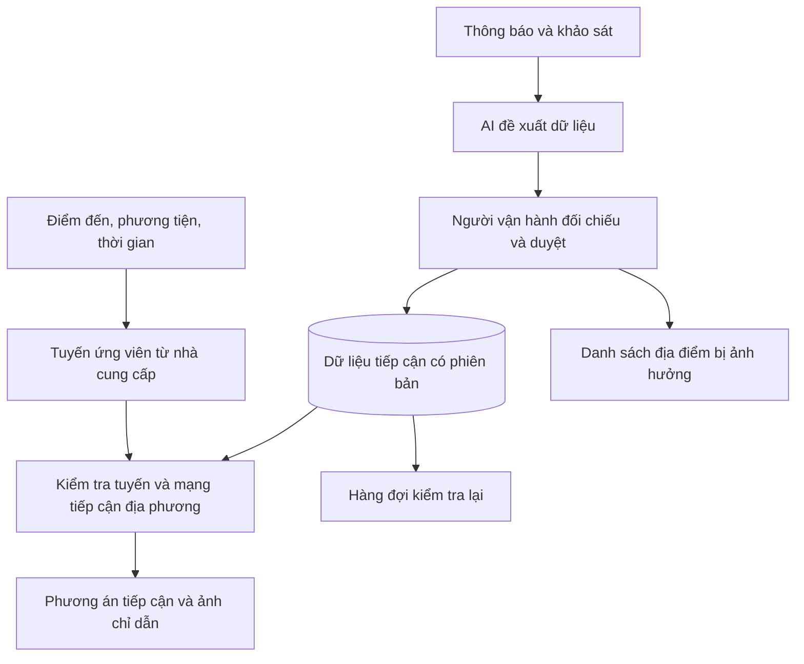

# LỐI TIẾP CẬN — AccessLink

## Bản đồ tiếp cận địa điểm trong khu vực thi công

**English descriptor:** Verified Destination Access for Construction-Affected Streets  
**Track:** TASCO — MLAI Hackathon 2026  
**Nhóm thực hiện:** Thang · Kien · Tu · Bao  
**Phiên bản:** 1.0 — 25/09/2026  
**Trạng thái:** Proposal triển khai; chưa hoàn thành khảo sát, prototype hoặc đo hiệu quả.  
**Hướng đề bài:** Giao thông và di chuyển thông minh; Dữ liệu, dịch vụ đô thị và tương tác cộng đồng; liên hệ Quy hoạch, hạ tầng và phát triển kinh tế – xã hội.

> **Đến đúng lối. Kết nối điểm đến.**

Tên Việt và Anh là tên làm việc của dự án, thay cho “Còn lối vào”. Chưa thực hiện kiểm tra nhãn hiệu hoặc tên miền. Tất cả số lượng, tiến độ và ngưỡng đánh giá bên dưới là kế hoạch đề xuất, không phải kết quả đã đạt.

## 1. Tóm tắt điều hành

AccessLink bổ sung lớp dữ liệu về khả năng tiếp cận từng địa điểm quanh khu vực thi công. Người dùng chọn điểm đến, phương tiện và thời gian; hệ thống tìm lối vào phù hợp từ mạng đường đã được khảo sát, bao gồm điểm gửi xe hoặc trả khách khi cần và chặng đi bộ cuối. Kết quả đi kèm ảnh nhận diện, nguồn xác nhận và thời điểm kiểm tra.

Đối tượng đầu tiên là khách đi xe máy đến các cửa hàng trên một đoạn đường đang thi công tại TP.HCM. Chủ cửa hàng và người khảo sát cung cấp thông tin tại chỗ; người vận hành đối chiếu với thông báo tổ chức giao thông và duyệt trước khi công bố. AI hỗ trợ đọc thông báo tiếng Việt và đề xuất các trường dữ liệu; thuật toán mạng đường kiểm tra điều kiện tiếp cận.

MVP tập trung vào một cụm 5–10 địa điểm, ưu tiên khảo sát khu vực ảnh hưởng bởi Metro số 2 theo đề xuất của Tú. Sản phẩm cần chứng minh hai kết quả: khách tìm đúng lối thuận lợi hơn cách hướng dẫn hiện có; người vận hành cập nhật được các địa điểm bị ảnh hưởng khi điều kiện thay đổi. Phạm vi nhỏ và cơ chế duyệt, hết hạn dữ liệu tiếp thu đề xuất của Bảo. [Góp ý của nhóm](https://docs.google.com/spreadsheets/d/1O8ufFkDSe5rYdlkSQhEztP_YHScpFW_K/edit).

Đầu ra gồm một web demo, dữ liệu khảo sát có nguồn, báo cáo thử nghiệm và pitch deck. Khả năng tích hợp với nền tảng bản đồ TASCO được thể hiện bằng hợp đồng dữ liệu/API mẫu; chưa có xác nhận tích hợp production hoặc quan hệ đối tác.

## 2. Bài toán và cơ sở nhu cầu

### 2.1. Quyết định người dùng đang thiếu thông tin

Khi công trình thay đổi cách tổ chức giao thông và lối vào, khách cần trả lời đồng thời:

- Địa điểm có đang hoạt động trong thời gian dự định đến không?
- Cửa nào đang sử dụng được và được phép vào?
- Xe máy có thể tới cửa hay cần gửi xe rồi đi bộ?
- Lối đó còn phù hợp vào giờ đến không?
- Thông tin do ai xác nhận và được kiểm tra lần cuối khi nào?

Giả thuyết sản phẩm là thông tin trên bản đồ, biển tại chỗ và hướng dẫn của cửa hàng chưa luôn thống nhất thành một hành trình có thể làm theo. Khoảng trống này phải được kiểm chứng tại địa bàn cụ thể bằng tác vụ tìm đường và phỏng vấn; chưa có khảo sát riêng của nhóm để định lượng mức phổ biến.

### 2.2. Bằng chứng công khai và giới hạn suy luận

| Bằng chứng | Ý nghĩa đối với dự án | Điều chưa thể suy ra |
|---|---|---|
| Bài đăng ngày 07/08/2026 của Trung tâm Báo chí TP.HCM dẫn thông tin điều chỉnh giao thông phục vụ Metro số 2 trên Cách Mạng Tháng Tám, áp dụng từ 13/08/2026, có phân biệt hướng và loại phương tiện | Có cơ sở để khảo sát hành lang Metro số 2 và mô hình hóa hạn chế có điều kiện | Không xác nhận lối vào cửa hàng nào đang bị chặn tại ngày khảo sát. [Nguồn](https://ttbc-hcm.gov.vn/tphcm-o-to-luu-thong-mot-chieu-duong-cach-mang-thang-tam-de-thi-cong-metro-so-2-1021929.html) |
| Bài viết lịch sử về tái lập đường Lê Lợi ghi nhận rào chắn ảnh hưởng kinh doanh và một cửa hàng phải chuyển vị trí | Thi công có thể gây gián đoạn tiếp cận và hoạt động thương mại | Không chứng minh AccessLink sẽ tăng doanh thu, cũng không mô tả hiện trạng Lê Lợi. [Nguồn](https://ttbc-hcm.gov.vn/dam-bao-my-quan-khi-tai-lap-mat-duong-le-loi-1011646.html) |
| Google Maps và Grab công bố các tính năng hỗ trợ tìm cửa vào, bãi đỗ hoặc điểm đón | Việc hoàn tất chặng cuối là một nhu cầu đã được sản phẩm lớn quan tâm | Không chứng minh tính năng hiện có thiếu ở mọi địa điểm Việt Nam. [Google](https://blog.google/products-and-platforms/products/maps/gemini-google-maps-navigation-updates/), [Grab](https://engineering.grab.com/poi-entrances-venues-door-to-door) |

Nguồn báo chí và thông báo dùng để chọn nơi khảo sát, truy xuất bằng chứng và xây dựng giả thuyết. Mỗi quy định đưa vào ứng dụng cần kiểm tra văn bản còn hiệu lực và hiện trạng liên quan. Một hạn chế dành cho ô tô không được chuyển thành lệnh cấm xe máy.

### 2.3. Những đặc điểm Việt Nam được khai thác

Thiết kế tập trung vào các đặc điểm có thể quan sát tại pilot: cửa hàng mặt phố, lối phụ qua hẻm, xe máy kết hợp đi bộ, tên gọi địa phương và thông báo tổ chức giao thông tiếng Việt. Các yếu tố này được chuyển thành dữ liệu cửa vào, đoạn nối, phương tiện, hướng di chuyển và thời gian hiệu lực.

Nhóm không mặc định mọi địa điểm đều có đủ các đặc điểm trên. Khảo sát quyết định trường dữ liệu nào thực sự cần và tình huống nào đáng đưa vào demo.

## 3. Người dùng, giá trị và phạm vi vấn đề

| Nhóm | Nhu cầu | Giá trị cần kiểm chứng |
|---|---|---|
| Khách chưa quen địa bàn, đi xe máy | Tìm đúng lối vào cửa hàng | Tăng tỷ lệ chọn đúng lối, giảm thời gian tìm và số lần quay lại/hỏi đường |
| Chủ cửa hàng tham gia pilot | Hướng dẫn khách theo tình trạng mới | Có một đường dẫn chia sẻ được, giảm việc giải thích lại cùng một chỉ dẫn |
| Người vận hành dữ liệu địa bàn | Biết thông tin nào thay đổi, ảnh hưởng tới đâu | Rút ngắn thời gian chuẩn hóa và duyệt cập nhật; theo dõi bản ghi cần kiểm tra lại |
| Đơn vị bản đồ/mobility, gồm TASCO nếu hợp tác | Bổ sung thông tin chặng cuối có cấu trúc | Tái sử dụng dữ liệu tiếp cận và sự kiện thay đổi trong sản phẩm hiện có |

Người dùng chính của MVP là khách đi xe máy; đi bộ là phương thức của chặng cuối. Ô tô trả khách, giao hàng và địa điểm nhiều khuôn viên là hướng mở rộng sau khi có dữ liệu tương ứng. Mỗi nhu cầu mới cần được đánh giá riêng.

### Câu định vị

**Tiếng Việt:** AccessLink giúp người dân tìm lối tiếp cận đã được xác nhận tới từng địa điểm quanh khu thi công, phù hợp với phương tiện và thời điểm của chuyến đi.

**English:** AccessLink helps people reach destinations on construction-affected streets through verified access points and connecting paths, matched to their travel mode and arrival time.

## 4. Giải pháp và vai trò thiết yếu của bản đồ

### 4.1. Ba lớp thông tin

1. **Hoạt động của địa điểm:** cửa hàng đang mở, đóng hoặc chưa được xác nhận, cùng giờ hoạt động.
2. **Khả năng tiếp cận:** cửa vào, điểm gửi xe/đón trả nếu có, đường nối và điều kiện sử dụng.
3. **Thay đổi theo thi công:** đoạn bị ảnh hưởng, phương tiện, chiều đi, thời gian, nguồn và phiên bản cập nhật.

Địa điểm có thể vẫn hoạt động trong khi lối mặt tiền không sử dụng được. Việc thêm thông tin về cửa hàng không tự giải quyết được quan hệ giữa các đoạn đường và cửa vào.

### 4.2. Đơn vị đầu ra: phương án tiếp cận

Một phương án gồm:

**Điểm xuất phát → đường tới điểm tiếp cận → điểm gửi xe nếu cần → chặng đi bộ → cửa vào → điểm đến.**

Mỗi đoạn phải nối được với đoạn kế tiếp, đúng hướng, đúng phương tiện và phù hợp với thời gian đi qua. Tuyến đi qua cửa đóng, rào chắn hoặc đoạn chưa có căn cứ sử dụng không đủ điều kiện để đề xuất.

Kết quả có ba trạng thái:

- **Có phương án đã xác nhận:** nêu rõ các chặng và thời điểm kiểm tra.
- **Chưa tìm thấy phương án phù hợp trong phạm vi đã khảo sát:** không diễn đạt thành địa điểm chắc chắn không thể tiếp cận từ mọi nơi.
- **Cần xác minh thêm:** thiếu dữ liệu, dữ liệu cũ hoặc các nguồn mâu thuẫn.

Bản đồ thiết yếu vì kết quả phụ thuộc vào cấu trúc mạng đường, cửa vào, rào cản và điều kiện của từng cạnh nối. Khoảng cách tới pin trung tâm địa điểm không giải được các quan hệ này.

## 5. Đối chiếu sản phẩm hiện có và khác biệt cần chứng minh

Phạm vi rà soát ngày 25/09/2026 là tài liệu công khai và mô tả sản phẩm; chưa phải kiểm thử tất cả ứng dụng tại pilot.

| Nền tảng | Khả năng đã công bố | Hệ quả đối với AccessLink |
|---|---|---|
| Google Maps | Hướng dẫn đến cửa vào, bãi đỗ và chặng đi bộ; công bố năm 2026 tiếp tục bổ sung chi tiết tiếp cận điểm đến | Cửa vào và chặng cuối đã có tiền lệ. Cần kiểm thử tình huống thay đổi lối tiếp cận tại địa bàn. [2024](https://blog.google/products-and-platforms/products/maps/gemini-google-maps-navigation-updates/), [2026](https://blog.google/products-and-platforms/products/maps/ask-maps-immersive-navigation/) |
| Grab | Điểm đón được chỉ định và hướng dẫn bằng chữ/ảnh trong các địa điểm lớn | Ảnh chỉ đường và lựa chọn điểm đón không phải tính năng độc quyền. [Nguồn](https://engineering.grab.com/poi-entrances-venues-door-to-door) |
| Waze | Đóng đường phục vụ công trình/sự kiện, thời gian hiệu lực và hạn chế có điều kiện | Cảnh báo công trình và tránh đường cấm đã tồn tại. [Nguồn](https://support.google.com/waze/partners/answer/10617147?hl=en) |
| T Maps của TASCO | Tìm địa điểm, dẫn đường; lịch sử phiên bản có đóng góp địa điểm và báo trạng thái hoạt động | Thiết kế dữ liệu tiếp cận để bổ sung vào nền hiện có. Chưa có căn cứ kết luận TASCO thiếu hoặc chưa nghiên cứu toàn bộ luồng này. [App Store](https://apps.apple.com/vn/app/t-maps/id6769729366) |

**Giả thuyết khác biệt:** liên kết một thay đổi thi công với danh sách địa điểm bị ảnh hưởng, tính lại phương án vào từng địa điểm và công bố hướng dẫn có nguồn, thời gian kiểm tra, điều kiện phương tiện.

Nhóm phải chứng minh giá trị của toàn bộ luồng này bằng các địa điểm thật. Nếu ứng dụng hiện có đã giải quyết tốt tác vụ tại một địa điểm, ghi nhận đó là trường hợp không có lợi ích bổ sung; không cố tạo baseline sai để làm nổi bật sản phẩm.

Lợi thế có thể tích lũy sau pilot là chất lượng mạng tiếp cận địa phương, lịch sử thay đổi và khả năng duy trì dữ liệu. Tính năng đơn lẻ hoặc việc gắn thêm AI chưa tạo ra lợi thế bền vững.

## 6. Phạm vi MVP và địa bàn khảo sát

### 6.1. Phạm vi cam kết thiết kế

| Thành phần | Mục tiêu MVP |
|---|---|
| Địa bàn | Một cụm liên tục trên đoạn đường thi công, có thể đi khảo sát lại |
| Địa điểm | 5–10 cửa hàng/cơ sở đồng ý tham gia |
| Mạng tiếp cận | Toàn bộ đoạn nối cần thiết cho các hành trình demo; dự kiến 20–40 cạnh tùy địa hình |
| Phương thức | Xe máy và chặng đi bộ; điểm gửi xe chỉ dùng khi đã xác nhận |
| Thời gian | Hiện trạng đã kiểm tra; một tình huống thay đổi để trình diễn |
| Dữ liệu thay đổi | Ít nhất một thông báo thật có nguồn; tình huống mở/đóng bổ sung gắn nhãn mô phỏng nếu chưa xảy ra |
| Giao diện | Web responsive cho khách và trang duyệt dữ liệu cho người vận hành |
| Phân phối | Link trực tiếp của địa điểm, QR hoặc lớp bản đồ; khách xem không cần tài khoản |

MVP không bao gồm dự báo tiến độ công trình, số chỗ đỗ trống theo thời gian thực, đo kích thước lối đi tự động từ ảnh hoặc điều hướng toàn TP.HCM. Nếu thêm ô tô trả khách, chỉ thêm một tình huống có dữ liệu riêng sau khi luồng xe máy đã hoàn chỉnh.

### 6.2. Chọn pilot theo đề xuất của Tú

Ưu tiên khảo sát một cụm cửa hàng trong hành lang Cách Mạng Tháng Tám liên quan Metro số 2. Thông báo công khai là đầu mối xác định bối cảnh, không phải dữ liệu đầy đủ về từng cửa hàng. Chưa chốt vị trí hay khẳng định lối nào đang đóng/mở. [Cơ sở chọn hành lang](https://ttbc-hcm.gov.vn/tphcm-o-to-luu-thong-mot-chieu-duong-cach-mang-thang-tam-de-thi-cong-metro-so-2-1021929.html).

Điều kiện chọn một cụm:

- Có khó khăn tiếp cận cụ thể được khách/chủ cửa hàng mô tả bằng tình huống đã xảy ra.
- Có lối thay thế hợp lệ hoặc sự khác nhau có ý nghĩa giữa các phương tiện/thời điểm.
- Có thể khảo sát toàn bộ chặng nối mà không đi vào khu vực hạn chế.
- Có nguồn xác nhận và người nhận trách nhiệm kiểm tra lại.
- Có thể tổ chức tác vụ so sánh với hướng dẫn hiện có.

Nếu cụm đầu tiên không đáp ứng, chuyển sang cụm thi công khác trước khi mở rộng tính năng. Không giữ địa bàn chỉ vì tên dự án nổi bật.

### 6.3. Hồ sơ khảo sát tối thiểu

Mỗi địa điểm lưu tên/biệt danh, tọa độ cửa, ảnh từ hướng khách tiếp cận, trạng thái hoạt động, đường nối, điều kiện phương tiện, nguồn xác nhận và giờ quan sát. Ghi riêng quy định giao thông công cộng, quy định của cơ sở và quan sát vật lý.

Phỏng vấn ngắn yêu cầu người tham gia kể lần gần nhất khách vào nhầm hoặc phải hỏi đường, chỉ vị trí xảy ra và cách họ đang xử lý. Ghi cả trường hợp không có vấn đề. Một người khác trong team đi lại tuyến để kiểm tra trước khi đánh dấu dữ liệu đã xác nhận.

## 7. Trải nghiệm sử dụng và tình huống mẫu

### 7.1. Khách tìm lối vào

1. Mở link cửa hàng hoặc tìm địa điểm trên bản đồ.
2. Chọn xe máy/đi bộ và thời điểm dự kiến đến.
3. Xem trạng thái hoạt động và phương án tiếp cận phù hợp.
4. Xem ảnh cửa, mốc nhận diện, chặng cần đi bộ và thời điểm kiểm tra.
5. Gửi phản ánh nếu thông tin không còn đúng; phản ánh tạo yêu cầu xác minh.

### 7.2. Người vận hành cập nhật

1. Nhập thông báo, ảnh biển hoặc ghi chú khảo sát.
2. AI đề xuất thời gian, phương tiện, chiều đi và đoạn/cửa liên quan; hiển thị đoạn nguồn tương ứng.
3. Người duyệt kiểm tra vị trí, căn cứ và khác biệt với bản đang dùng.
4. Công bố một phiên bản mới; hệ thống tính lại địa điểm bị ảnh hưởng.
5. Các link hướng dẫn đọc dữ liệu mới; hệ thống đưa bản ghi cần tái kiểm tra vào hàng đợi.

### 7.3. Kịch bản minh họa

**Dữ liệu giả định để thiết kế, không phải hiện trạng Metro số 2:** cửa hàng A đang hoạt động, cửa mặt tiền E1 bị rào; cửa phụ E2 được phép cho khách đi bộ. Điểm P nhận gửi xe máy trong khung giờ đã xác nhận, có đường đi bộ nối tới E2.

Ứng dụng đề xuất đi xe máy tới P rồi đi bộ tới E2. Khi P hết giờ nhận xe, hệ thống kiểm tra phương án khác; nếu không có dữ liệu đủ, trả trạng thái cần xác minh. Khi người vận hành duyệt thay đổi của E2, mọi phương án phụ thuộc E2 được đánh giá lại.

Trạng thái “không tiếp cận được bằng xe máy trong dữ liệu hiện có” không tự chuyển thành “cửa hàng đóng cửa”.

## 8. Chiến lược dữ liệu và vận hành

### 8.1. Nguồn và phạm vi xác nhận

| Nguồn | Dữ liệu lấy được | Điều kiện sử dụng |
|---|---|---|
| Khảo sát của nhóm | Cửa vào, đường nối, rào chắn, ảnh và mốc chỉ dẫn | Ghi giờ, vị trí, người khảo sát và bước kiểm tra chéo |
| Cửa hàng/đơn vị quản lý điểm đến | Giờ hoạt động, cửa dành cho khách, hướng dẫn nội bộ | Chỉ xác nhận trong phạm vi quản lý; không tự cho phép đi qua đường công cộng đang cấm |
| Văn bản/biển báo của cơ quan hoặc đơn vị có thẩm quyền | Phương tiện, hướng, phạm vi và thời gian hạn chế | Kiểm tra hiệu lực, ngoại lệ và văn bản thay thế |
| Người dùng | Dấu hiệu thông tin đã thay đổi | Đưa vào hàng đợi; chưa trực tiếp biến thành một lối được phép sử dụng |
| Nhà cung cấp bản đồ | Nền bản đồ, tìm địa điểm, tuyến ứng viên | Dùng theo điều khoản API; lưu/xuất dữ liệu nhà cung cấp chỉ khi được phép |
| Dữ liệu mô phỏng | Kiểm tra đóng/mở, hết hạn, xung đột | Tách khỏi dữ liệu thực địa và hiển thị nhãn rõ trong demo |

### 8.2. Vòng đời và độ mới

Luồng bản ghi: **nháp → chờ xác minh → đã duyệt → cần kiểm tra lại / bị thay thế**. Hiệu lực quy định và độ mới của quan sát là hai thuộc tính riêng.

- `observed_at`: thời điểm quan sát thực tế.
- `published_at`: thời điểm nguồn được công bố.
- `valid_from`, `valid_to`: khoảng hiệu lực nếu có căn cứ xác định.
- `reviewed_at`, `review_due_at`: lần duyệt và hạn kiểm tra lại do nhóm thiết lập.
- `version`, `supersedes_id`: phiên bản và quan hệ thay thế.

Quá hạn kiểm tra không có nghĩa một lệnh cấm hết hiệu lực, cũng không có nghĩa hàng rào đã được tháo. Một quan sát cho phép đi đã cũ không được dùng để khẳng định lối vẫn mở. Khi nguồn mâu thuẫn, giữ lại cả hai và ngừng đề xuất đoạn có điều kiện chưa giải quyết được. Quy định cấm còn hiệu lực không bị một phản ánh “đi được” ghi đè.

Trong pilot, đề xuất kiểm tra các lối đang biến động trước buổi thử nghiệm và ít nhất mỗi ngày có vận hành, kết hợp kiểm tra lại khi nhận thông báo. Đây là lịch thử nghiệm phải điều chỉnh theo thực tế, không phải SLA sản phẩm đã cam kết. Nếu nhóm không đáp ứng được thì giảm phạm vi cung cấp hướng dẫn.

### 8.3. Dữ liệu có thể tái sử dụng

Nhóm giữ nguồn, quyền sử dụng và phạm vi chia sẻ ở từng bộ dữ liệu. Ảnh tự chụp phục vụ chỉ dẫn cần tránh hoặc che thông tin nhận diện không cần thiết. Tọa độ khách dùng để tính tuyến không mặc định lưu thành lịch sử di chuyển. Link công khai không chứa số điện thoại cá nhân của người xác nhận; danh tính người duyệt nội bộ được phân quyền.

Việc một bài báo hoặc ảnh có thể xem công khai không tự cấp quyền tái xuất bản toàn bộ. Ưu tiên dữ kiện đã chuẩn hóa kèm đường dẫn nguồn và ảnh khảo sát do nhóm có quyền sử dụng.

## 9. Mô hình dữ liệu đề xuất

Hình học trao đổi dùng GeoJSON/WGS84, thứ tự tọa độ `[longitude, latitude]`. Khoảng cách đo bằng phép tính địa lý hoặc hệ tọa độ mét phù hợp; thời gian lưu kèm múi giờ, hiển thị Asia/Ho_Chi_Minh.

| Thực thể | Trường chính | Vai trò |
|---|---|---|
| `Place` | `id`, `name`, `aliases`, `location`, `operator_id` | Điểm đến; tách khỏi tọa độ cửa |
| `PlaceOperation` | `place_id`, `status`, `opening_windows`, `evidence_ids`, `review_due_at` | Trạng thái hoạt động và giờ mở |
| `AccessNode` | `id`, `place_id`, `type`, `geometry`, `label`, `evidence_ids` | Cửa, giao điểm, điểm gửi xe hoặc chuyển phương thức |
| `AccessEdge` | `id`, `from_node`, `to_node`, `geometry`, `length_m`, `allowed_modes`, `direction`, `evidence_ids` | Đường nối có hướng giữa các node |
| `WorkZone` | `id`, `name`, `geometry`, `source_ids` | Phạm vi công trình để tra cứu và liên kết |
| `AccessRule` | `id`, `target_type`, `target_id`, `mode`, `purpose`, `direction`, `effect`, `valid_from`, `valid_to`, `time_windows`, `evidence_ids`, `version` | Điều kiện áp dụng cho cửa hoặc đoạn |
| `Evidence` | `id`, `type`, `source_url`, `observed_at`, `published_at`, `authority_scope`, `reviewed_at`, `review_due_at`, `review_status`, `rights`, `is_simulated` | Nguồn gốc, mức kiểm tra và quyền sử dụng |
| `ChangeSet` | `id`, `draft_rules`, `reviewer_id`, `published_at`, `version`, `affected_place_ids` | Một lần duyệt/công bố cập nhật |
| `AccessPlan` | `place_id`, `arrival_time`, `mode`, `status`, `legs`, `evidence_ids`, `data_version`, `limitations` | Kết quả trả cho ứng dụng bản đồ |

`review_status` phản ánh quy trình xác minh; không dùng điểm tự tin của LLM để thay thế bằng chứng. `no_plan_found` luôn đi kèm phạm vi mạng đã tìm kiếm.

### Ví dụ quy tắc dùng cho kiểm thử

```json
{
  "id": "rule_demo_e1_closed",
  "target_type": "access_node",
  "target_id": "entrance_demo_e1",
  "mode": ["motorcycle", "walk"],
  "purpose": ["customer"],
  "direction": "both",
  "effect": "closed",
  "valid_from": "2026-09-25T08:00:00+07:00",
  "valid_to": null,
  "evidence_ids": ["synthetic_notice_01"],
  "version": 1,
  "is_simulated": true
}
```

`valid_to: null` có nghĩa chưa biết mốc kết thúc; hệ thống không tự điền ngày hoàn công dự kiến thành ngày lối mở lại.

## 10. Kiến trúc và thuật toán

### 10.1. Kiến trúc MVP



Stack đề xuất: React/Next.js cho web, API TypeScript cho nghiệp vụ, PostgreSQL/PostGIS cho dữ liệu không gian và kho ảnh. Dùng bản đồ/API Goong trong phạm vi được cấp; mô-đun AI được gọi qua backend. Đây là lựa chọn triển khai dự kiến, điều chỉnh theo năng lực thành viên và tài nguyên BTC.

### 10.2. Hai phần hành trình

**Phần đường ngoài pilot:** lấy tuyến tới các điểm nối hợp lệ ở rìa khu khảo sát. Goong công bố API Directions với hình học, thời gian và tuyến thay thế. Tài liệu có mô tả phương tiện chưa nhất quán giữa phần giới thiệu và bảng tham số; cần xác nhận mã xe máy, quyền API và thử request thực trước khi tích hợp. [Goong Directions V2](https://help.goong.io/kb/rest-api-v2/directions-rest-api-v2/directions-v2/).

**Phần tiếp cận địa phương:** tìm trên graph có hướng do nhóm khảo sát. Chỉ chuyển từ xe máy sang đi bộ tại node có điều kiện gửi xe/chuyển phương thức đã xác nhận. Một điểm trả khách không được mặc định dùng như bãi gửi xe.

Cả hai phần đều phải kiểm tra các hạn chế đã biết. Việc đổi đích sang cửa phụ không đủ nếu tuyến ngoài pilot vẫn xuyên qua đoạn cấm. Dùng hình học để tìm ứng viên giao cắt, sau đó kiểm tra hướng, tầng đường và quan hệ thật; không coi mọi đường giao nhau trên mặt phẳng là một ngã rẽ.

### 10.3. Quy trình tìm phương án

1. Đọc một phiên bản dữ liệu nhất quán cho toàn bộ truy vấn.
2. Xác định cửa và điểm chuyển phương thức có thể phục vụ mục đích của khách.
3. Kiểm tra quy định, trạng thái vật lý, độ mới và quyền sử dụng của từng cạnh.
4. Loại cạnh bị cấm, bị chặn hoặc chưa đủ căn cứ; tìm đường trên phần còn lại.
5. Đánh giá thời gian dự kiến đi qua từng đoạn, gồm thời gian chuyển phương thức. MVP không tự tối ưu chờ đến lúc cửa mở.
6. So sánh tổng thời gian và quãng đi bộ trong các phương án hợp lệ; cho người dùng xem đánh đổi.
7. Trả nguồn, phiên bản, trạng thái và giới hạn của kết quả.

Có thể dùng Dijkstra/A* cho ảnh chụp trạng thái cố định. Với quy tắc đổi theo thời gian, phải đánh giá trạng thái tại lúc đến cạnh; MVP có thể kiểm tra lại toàn bộ các tuyến ứng viên và từ chối tuyến không còn hợp lệ, thay vì tuyên bố tìm tối ưu toàn mạng. Không đổi một lệnh cấm thành “điểm phạt cao” mà thuật toán vẫn được phép vượt qua.

Nếu tất cả tuyến nhà cung cấp trả về đều không đáp ứng, trả “chưa tìm được phương án trong dữ liệu hiện có”. Tập tuyến ứng viên không bảo đảm chứa mọi phương án trên thực địa. Điểm nối GPS không được tự kéo sang phía bên kia tường hoặc đường phân cách chỉ vì gần hơn.

### 10.4. Hợp đồng tích hợp mẫu

- `GET /places/{id}/access?mode=...&arrival_time=...`: phương án vào một địa điểm.
- `GET /access-layer?bbox=...&time=...`: dữ liệu lớp bản đồ trong vùng.
- `POST /reports`: phản ánh/quan sát chờ duyệt.
- `POST /changesets/{id}/publish`: thao tác của người duyệt đã xác thực.
- `GET /changes?since_version=...`: thay đổi để ứng dụng đồng bộ.

Các endpoint là thiết kế của AccessLink, không phải API sẵn có của TASCO. Khi công bố một ChangeSet, cập nhật rule và phiên bản đồng thời, rồi vô hiệu hóa cache liên quan để tránh hiển thị tuyến từ bản dữ liệu cũ.

## 11. Vai trò AI và cách chứng minh hiệu quả

### Nhiệm vụ chính

AI đọc văn bản/ảnh thông báo tiếng Việt để đề xuất tên đường, hai đầu đoạn, chiều bị ảnh hưởng, nhóm phương tiện, ngoại lệ và thời gian. Với mô tả mơ hồ, trả danh sách vị trí ứng viên cùng phần văn bản làm căn cứ để người duyệt chọn.

Ảnh khảo sát hỗ trợ nhận diện biển và mốc cửa. Ảnh có khe hở cạnh rào không đủ chứng minh đó là lối được phép đi; hình ảnh cũng không mặc định đủ để đo bề rộng hoặc xác nhận khả năng tiếp cận xe lăn.

Đường đi được tính từ dữ liệu đã duyệt. Phát hiện xung đột, kiểm tra thời gian và xác định các địa điểm bị ảnh hưởng là nghiệp vụ có thể dùng quy tắc/thuật toán. Giải thích cho khách ưu tiên mẫu câu dựa trên dữ liệu để giữ đúng lý do lựa chọn.

### Bộ đánh giá AI đề xuất

Chuẩn bị khoảng 20–30 thông báo/ghi chú độc lập có quyền sử dụng, gồm mô tả thiếu ngày kết thúc, tên đường gần giống, ngoại lệ phương tiện và nhiều hướng. Nhãn do hai người kiểm tra; tách tập dùng chỉnh prompt khỏi tập đánh giá. Chia theo tài liệu nguồn, không chia các đoạn của cùng một thông báo sang cả hai tập.

Đo độ đúng của ngày giờ, phương tiện, chiều, đoạn đường; tỷ lệ cần người sửa; thời gian hoàn thành một cập nhật có AI so với nhập tay. Mẫu tổng hợp được báo riêng. Không dùng chất lượng trên mẫu tổng hợp để khẳng định chất lượng thực địa.

Điều kiện chấp nhận: AI phải giúp giảm công nhập/đối chiếu mà không làm tăng lỗi còn sót sau duyệt. Kết quả cuối cùng cần báo số mẫu và loại lỗi, không chỉ một tỷ lệ tổng hợp.

## 12. Kịch bản demo 4 phút

| Thời gian | Thao tác | Bằng chứng cần nhìn thấy |
|---|---|---|
| 0:00–0:35 | Giới thiệu một địa điểm pilot và khó khăn thực tế | Ảnh khảo sát, thời điểm và tình huống khách đã gặp |
| 0:35–1:15 | Chọn địa điểm, xe máy, giờ đến | Phương án đến điểm gửi xe hợp lệ rồi đi bộ tới cửa, hoặc đi thẳng nếu được |
| 1:15–1:45 | Mở ảnh cửa và lý do chọn | Người xem hiểu đường nối, điều kiện và nguồn |
| 1:45–2:35 | Nhập một thông báo; kiểm tra và duyệt đề xuất AI | Trích xuất đúng phương tiện/hướng/giờ; có bước sửa khi cần |
| 2:35–3:10 | Công bố thay đổi | Danh sách địa điểm bị ảnh hưởng và phương án cập nhật theo phiên bản |
| 3:10–3:35 | Xem trường hợp dữ liệu thiếu hoặc cần kiểm tra lại | Hệ thống không vẽ tuyến xuyên rào; không đổi trạng thái hoạt động cửa hàng sai |
| 3:35–4:00 | Mở kết quả thử nghiệm và mẫu tích hợp | Số mẫu, mức cải thiện đo được, payload dữ liệu có thể bàn giao |

Tình huống thay đổi chỉ gắn nhãn “thực tế” khi có bằng chứng đúng thời điểm. Nếu mô phỏng đóng một cửa để kiểm thử, nhãn mô phỏng hiển thị xuyên suốt. Có bản dữ liệu cố định và video dự phòng cho lỗi mạng; công bố rõ khi dùng bản dự phòng thay vì dữ liệu mới.

## 13. Kế hoạch đánh giá giá trị

### 13.1. Thử với người dùng

Tuyển 8–12 người chưa quen các địa điểm được giao, mỗi người làm các tác vụ tương đương bằng AccessLink và cách hiện có. Đảo thứ tự hai phương pháp giữa người tham gia và dùng địa điểm khác để giảm ảnh hưởng nhớ đường. Khảo sát viên xác nhận đáp án tại thời điểm thử.

Baseline là ứng dụng/hướng dẫn mà người đó đang dùng, gồm cả chỉ dẫn cửa hàng nếu bình thường họ nhận được. Không cố bỏ thông tin sẵn có. Ghi rõ tác vụ chỉ xem màn hình hay đến nơi thực tế. Với đoạn hạn chế, đánh giá lựa chọn trên màn hình; không yêu cầu người thử đi vào công trường.

| Chỉ số | Cách đo | Mục tiêu quyết định |
|---|---|---|
| Chọn đúng lối | Tác vụ chọn cửa/phương án hợp lệ chia tổng tác vụ | Cao hơn baseline trên các trường hợp có khoảng trống dữ liệu |
| Thời gian xác định lối | Từ lúc mở hướng dẫn đến khi chọn được phương án đúng | Mục tiêu thử nghiệm giảm trung vị khoảng 20%; không phải cam kết |
| Quay lại/hỏi đường | Đếm trên từng tác vụ thực địa; tách gọi điện và hỏi trực tiếp | Giảm so với baseline, báo số đếm thực |
| Độ phủ xác minh | Tỷ lệ cạnh/chiều dài trong phương án có bằng chứng còn phù hợp | Các phương án được gắn “đã xác nhận” phải đáp ứng toàn bộ điều kiện dữ liệu đã định |
| Lỗi tuyến nghiêm trọng | Tuyến đi qua cạnh bị chặn/cấm trong bộ tình huống | Không có lỗi loại này trong bộ kiểm tra bắt buộc |
| Công vận hành | Phút nhập, duyệt và tái khảo sát trên địa điểm/tuần | Nằm trong nguồn lực người vận hành có thể duy trì |

Báo kết quả theo số người, số tác vụ, trung vị và phân bố; ghi cả trường hợp thất bại. Mẫu nhỏ chỉ cho tín hiệu ban đầu, không đủ suy rộng toàn thành phố hoặc chứng minh tăng doanh thu.

### 13.2. Các kiểm tra chức năng bắt buộc

- Quy định cấm một chiều không chặn nhầm chiều còn lại; ngoại lệ phương tiện được giữ.
- Cửa đóng, điểm gửi xe hết giờ hoặc cạnh không liên thông loại đúng phương án.
- Quy tắc được đánh giá theo giờ đi qua, có kiểm tra tại ranh giới khung giờ.
- Thiếu lối thay thế trả đúng trạng thái; không tự coi đường gần nhất là đường nối.
- Nguồn mâu thuẫn hoặc quan sát cũ không tự mở một cạnh đang bị cấm.
- Duyệt thay đổi làm cập nhật đúng địa điểm phụ thuộc; các địa điểm không liên quan không bị thay đổi.
- Dữ liệu mô phỏng không được công bố lẫn vào lớp thực địa.

## 14. Đối chiếu từng mục rubric TASCO

Bảng này là kế hoạch bằng chứng theo rubric đã đọc ngày 25/09/2026, không phải dự đoán điểm. Tổng tối đa 100 điểm. [Challenge Brief MLAI](https://docs.google.com/document/d/11fRaBedWrh4XwWld9_dqoMTgj-lNi88Buzr5y3i0QOE/edit).

| Nhóm tiêu chí | Thành phần | Điểm tối đa | Bằng chứng trong hồ sơ/demo |
|---|---|---:|---|
| Vấn đề và tác động | Người dùng cụ thể | 5 | Persona khách xe máy, tình huống khảo sát, tiêu chí tuyển người thử |
| Vấn đề và tác động | Đúng nhu cầu, giá trị rõ | 10 | So sánh chọn đúng lối, thời gian và số lần hỏi/quay lại |
| Vấn đề và tác động | Tác động rộng hơn | 5 | Cách nhân rộng theo cụm công trình và người vận hành; giới hạn chi phí |
| Phù hợp Việt Nam | Đặc điểm địa phương | 5 | Lối phụ, xe máy–đi bộ, chỉ dẫn tiếng Việt được ghi nhận tại pilot |
| Phù hợp Việt Nam | Dữ liệu, hạ tầng, triển khai | 10 | Nguồn thực địa, web trên điện thoại, quy trình cập nhật khả thi |
| Sáng tạo và khác biệt | So với sản phẩm hiện có | 10 | Kiểm thử tác vụ đối chiếu và bảng cạnh tranh có nguồn |
| Sáng tạo và khác biệt | Giá trị của lớp bản đồ | 10 | Thay đổi một rule dẫn đến tính lại lối vào của các địa điểm liên quan |
| Dữ liệu và AI | Thu thập, tích hợp, cập nhật | 5 | Schema, Evidence, ChangeSet, lịch kiểm tra và người chịu trách nhiệm |
| Dữ liệu và AI | Khai thác nguồn dữ liệu | 5 | Kết hợp mạng đường, khảo sát, thông báo và phản ánh có duyệt |
| Dữ liệu và AI | AI/GeoAI phù hợp | 10 | Bộ đánh giá trích xuất/ghép vị trí và công nhập giảm so với làm tay |
| Khả thi và prototype | Web hoạt động | 5 | Luồng tìm–xem–duyệt–cập nhật chạy được, bộ tình huống bắt buộc |
| Khả thi và prototype | Vận hành, mở rộng, tích hợp | 10 | Hợp đồng API, phiên bản dữ liệu, chi phí vận hành và trách nhiệm đối tác |
| Trình bày và UX | Giao diện | 5 | Người thử hiểu cửa nào dùng được, chặng đi bộ và tình trạng dữ liệu |
| Trình bày và UX | Pitch và trả lời BGK | 5 | Demo 4 phút, kết quả thật, trả lời rõ đối thủ và giới hạn |

Brief yêu cầu Working Web Demo và Pitch Deck, đồng thời cho phép các nguồn dữ liệu hợp pháp và dữ liệu giả lập theo mô tả của đề. Việc dùng giả lập để thử engine không thay thế bằng chứng khảo sát người dùng.

## 15. Kế hoạch triển khai và phân công

### 15.1. Trước giai đoạn phát triển tập trung

Hoàn thành chọn cụm pilot, xác nhận người cung cấp dữ liệu, kiểm tra API, vẽ mạng tiếp cận và xây một tác vụ có thể đo. Chỉ khóa phạm vi phát triển khi có ít nhất vài tình huống chứng minh giá trị bổ sung.

### 15.2. Kịch bản làm việc 48 giờ

Đây là kế hoạch nội bộ tham khảo; điều chỉnh theo thời lượng, quy định sử dụng sản phẩm/dữ liệu chuẩn bị trước của BTC.

| Thời gian | Kết quả cần có |
|---|---|
| 0–8 giờ | Schema, dữ liệu pilot, bản đồ và một phương án tiếp cận chạy xuyên suốt |
| 8–20 giờ | Điều kiện phương tiện/thời gian, trang chi tiết cửa và nguồn |
| 20–30 giờ | AI tạo bản nháp, màn hình duyệt, phiên bản và cập nhật ảnh hưởng |
| 30–38 giờ | Kiểm tra chức năng, tác vụ người dùng, sửa lỗi trọng yếu |
| 38–44 giờ | Tổng hợp số đo, hoàn thiện giao diện, pitch và payload tích hợp |
| 44–48 giờ | Diễn tập, video dự phòng, đóng gói bàn giao |

### 15.3. Phân công đề xuất để nhóm thống nhất

| Thành viên | Trách nhiệm đề xuất | Đầu ra |
|---|---|---|
| Thang | Điều phối sản phẩm, web cho khách và pitch | Luồng sử dụng rõ, giới hạn phạm vi, câu chuyện có bằng chứng |
| Kien | Backend, mô hình mạng tiếp cận và tích hợp bản đồ | API, kiểm tra điều kiện, tính lại phương án |
| Tu | Thiết kế khảo sát và đánh giá theo góp ý đã đưa ra | Cụm pilot, dữ liệu nhãn, tác vụ và kết quả so sánh |
| Bao | Quy trình dữ liệu, trang duyệt và AI trích xuất | Nhập–duyệt–cập nhật, quản lý nguồn/độ mới, đánh giá AI |

Đây chưa phải cam kết phân công của từng người. Khảo sát thực địa nên đi theo cặp; kiểm tra chéo nhãn cần người không trực tiếp tạo bản ghi ban đầu.

## 16. Hướng phát triển cùng TASCO và mô hình vận hành

### 16.1. Giá trị tích hợp đề xuất

TASCO có thể thử nghiệm hiển thị nút “Lối tiếp cận” trong trang địa điểm, dùng điểm tiếp cận làm đích của chặng đường ngoài, và nhận sự kiện thay đổi để cập nhật hướng dẫn. AccessLink cung cấp dữ liệu đường nối và điều kiện có phiên bản. Quyền ghi vào nền tảng và quy trình duyệt chung cần được thống nhất với TASCO; chưa có API nội bộ hoặc thỏa thuận tích hợp được xác nhận.

T Maps đã có các khả năng đóng góp địa điểm và báo trạng thái hoạt động được mô tả trên App Store. Do đó, đề xuất hợp tác ưu tiên dữ liệu quan hệ giữa cửa–đường nối–quy định thi công, đồng thời tái sử dụng quy trình địa điểm sẵn có nếu được phép. [T Maps](https://apps.apple.com/vn/app/t-maps/id6769729366).

### 16.2. Mô hình duy trì cần thử

Người dân truy cập hướng dẫn miễn phí trong pilot. Giả thuyết khách hàng trả phí ở giai đoạn sau là đơn vị vận hành bản đồ/mobility hoặc đơn vị quản lý cụm địa điểm muốn thuê cập nhật và tích hợp dữ liệu. Chưa có bằng chứng sẵn sàng chi trả; chủ cửa hàng là người cung cấp và hưởng lợi trước, chưa mặc định là bên mua dịch vụ.

Đo chi phí theo công khảo sát mỗi địa điểm, phút duyệt mỗi thay đổi, số lần tái kiểm tra mỗi tuần và phí hạ tầng/API/AI. Ước tính chi phí vận hành một cụm bằng các số đo này trước khi đề xuất mức giá. Khả năng duy trì độ mới quyết định tốc độ mở rộng.

### 16.3. Lộ trình sau hackathon

| Giai đoạn đề xuất | Phạm vi | Điều kiện để đi tiếp |
|---|---|---|
| 2–4 tuần | Vận hành cụm đầu, ghi nhận thay đổi thực | Có người dùng thử, lối được xác minh và công cập nhật chấp nhận được |
| 1–3 tháng | Thử ở cụm thứ hai, đánh giá khả năng tái sử dụng schema | Giữ được chất lượng khi đổi địa bàn, nguồn và người vận hành |
| Sau khi có đối tác | Thử tích hợp lớp dữ liệu vào nền tảng bản đồ | Thống nhất quyền dữ liệu, API, trách nhiệm duyệt và chỉ tiêu dịch vụ |

Mở rộng mục đích giao hàng/ô tô hoặc sự kiện chỉ khi lớp dữ liệu lõi và quy trình vận hành đã ổn định. Một prototype chưa chứng minh được hiệu quả ở quy mô thành phố.

## 17. Rủi ro chính và quyết định ứng phó

| Rủi ro | Dấu hiệu | Quyết định |
|---|---|---|
| Không có khoảng trống đủ rõ tại pilot | Hướng dẫn hiện có đã đưa khách đúng lối | Đổi cụm hoặc thu hẹp vấn đề; ghi trung thực kết quả |
| Dữ liệu thay đổi nhanh hơn khả năng kiểm tra | Nhiều bản ghi quá hạn, khách báo sai | Giảm địa bàn phục vụ, đưa về cần xác minh; tìm người vận hành tại chỗ |
| Không có lối thay thế hợp lệ | Chỉ có khoảng hở hoặc đường xuyên công trường | Trả không tìm được phương án; không tạo tuyến để hoàn tất demo |
| AI trích sai chiều/ngoại lệ | Lỗi trong tập kiểm tra hoặc người duyệt bỏ sót | Hiển thị nguồn cạnh từng trường, xác nhận bắt buộc các trường trọng yếu |
| Tuyến nhà cung cấp đi qua đoạn bị ảnh hưởng | Kiểm tra hình học/quy định phát hiện giao cắt | Loại tuyến, dùng mạng pilot đã khảo sát hoặc trả thiếu phương án |
| Tính năng trùng sản phẩm hiện có | Baseline cho kết quả tương đương | Tập trung vào công cập nhật/ảnh hưởng theo địa điểm nếu có lợi ích đo được |
| Tích hợp chưa sẵn sàng | Chưa có quyền/API hoặc điều khoản phù hợp | Chứng minh bằng web và hợp đồng dữ liệu độc lập, ghi đúng trạng thái |

## 18. Nội dung pitch và hồ sơ bàn giao

### Pitch ngắn

“Khi đường trước một cửa hàng bị rào để thi công, khách cần biết cửa hàng còn hoạt động không và có thể vào bằng lối nào. AccessLink kết nối thông báo, khảo sát và xác nhận tại chỗ thành lớp dữ liệu tiếp cận theo phương tiện và thời gian. Người dùng nhận được phương án tới đúng cửa; khi điều kiện thay đổi, người vận hành duyệt cập nhật và hệ thống tính lại những địa điểm bị ảnh hưởng. Chúng tôi bắt đầu từ một cụm nhỏ tại TP.HCM và đo hiệu quả bằng tỷ lệ tìm đúng lối, thời gian tìm và số lần phải hỏi đường.”

### Dàn ý pitch deck

1. Tình huống thực địa và người dùng đầu tiên.
2. Bằng chứng nhu cầu và hạn chế của cách đang dùng tại pilot.
3. Lớp tiếp cận và một hành trình minh họa.
4. Demo cập nhật ảnh hưởng tới địa điểm.
5. Dữ liệu, nguồn xác nhận và vai trò AI.
6. Kết quả đo so với baseline, gồm cả lỗi và giới hạn.
7. Khác biệt có kiểm chứng, vận hành và khả năng tích hợp TASCO.
8. Kế hoạch tiếp theo và nguồn lực cần đối tác hỗ trợ.

### Gói bàn giao

- Web demo và hướng dẫn chạy.
- GeoJSON/mạng tiếp cận pilot, danh mục nguồn và quyền sử dụng.
- Phiên bản dữ liệu thực địa tách khỏi kịch bản mô phỏng.
- Mẫu request/response của API AccessLink.
- Bộ tình huống kiểm tra, kết quả thử người dùng và đánh giá AI.
- Pitch deck và video demo dự phòng.

### Câu hỏi cần trao đổi với mentor

- Schema và cơ chế nhận cập nhật nào phù hợp với nền tảng TASCO?
- API bản đồ/phương tiện nào được cấp và có thể dùng trong demo?
- Quy trình xác minh đóng góp hiện có có thể nhận thêm lối vào/đường nối không?
- Có nguồn thông báo hoặc đầu mối địa bàn nào được phép hợp tác sau hackathon?

## 19. Ghi nhận đóng góp và nguồn tham khảo

### Đóng góp đã tiếp thu

**Tú:** chọn một khu thi công thật, ưu tiên khảo sát Metro số 2; mô hình hóa thời gian, phương tiện, cửa/điểm chuyển; đo tìm đúng lối, thời gian và số lần quay lại/hỏi đường; dùng AI hỗ trợ trích xuất, dữ liệu đã xác nhận quyết định đường đi.

**Bảo:** giới hạn một cụm 5–10 địa điểm; cập nhật có người duyệt; tính lại khả năng tiếp cận khi điều kiện đổi; làm rõ nguồn, độ mới và khác biệt so với sản phẩm hiện có.

Các chi tiết kiến trúc, ngưỡng đánh giá, lịch và phân công trong tài liệu là phần đề xuất bổ sung để nhóm thống nhất. [Nguồn góp ý — tab Tu và Bao, đọc ngày 25/09/2026](https://docs.google.com/spreadsheets/d/1O8ufFkDSe5rYdlkSQhEztP_YHScpFW_K/edit).

### Nguồn ngoài đã kiểm tra ngày 25/09/2026

| Nguồn | Mục đích sử dụng |
|---|---|
| [Challenge Brief MLAI — TASCO](https://docs.google.com/document/d/11fRaBedWrh4XwWld9_dqoMTgj-lNi88Buzr5y3i0QOE/edit) | Phạm vi đề, đầu ra, nguồn lực và rubric 100 điểm |
| [Trung tâm Báo chí TP.HCM — Điều chỉnh giao thông Cách Mạng Tháng Tám, 07/08/2026](https://ttbc-hcm.gov.vn/tphcm-o-to-luu-thong-mot-chieu-duong-cach-mang-thang-tam-de-thi-cong-metro-so-2-1021929.html) | Cơ sở chọn hành lang khảo sát; bài dẫn thông tin từ Sở Xây dựng, không thay văn bản gốc |
| [Trung tâm Báo chí TP.HCM — Tái lập mặt đường Lê Lợi](https://ttbc-hcm.gov.vn/dam-bao-my-quan-khi-tai-lap-mat-duong-le-loi-1011646.html) | Bối cảnh tác động kinh doanh trong lịch sử |
| [Google Maps — Arrival guidance, 31/10/2024](https://blog.google/products-and-platforms/products/maps/gemini-google-maps-navigation-updates/) | Tiền lệ cửa vào, bãi đỗ và đi bộ chặng cuối |
| [Google Maps — Ask Maps and Immersive Navigation, 2026](https://blog.google/products-and-platforms/products/maps/ask-maps-immersive-navigation/) | Đối chiếu tính năng tiếp cận mới; phạm vi triển khai không mặc định đồng nhất tại Việt Nam |
| [Grab Engineering — Door-to-door guidance, 12/04/2019](https://engineering.grab.com/poi-entrances-venues-door-to-door) | Điểm đón và khảo sát/hướng dẫn bằng ảnh |
| [Waze Partners Help — Plan road closures](https://support.google.com/waze/partners/answer/10617147?hl=en) | Tiền lệ đóng đường, thời gian và hạn chế có điều kiện |
| [T Maps — App Store, nhà phát triển Tasco Joint Stock Company](https://apps.apple.com/vn/app/t-maps/id6769729366) | Mô tả công khai và lịch sử tính năng; không phải xác nhận roadmap nội bộ |
| [Goong — Directions V2](https://help.goong.io/kb/rest-api-v2/directions-rest-api-v2/directions-v2/) | Tuyến ứng viên, hình học, khoảng cách/thời gian; cần kiểm tra quyền và tham số thực tế |

**Mốc quyết định tiếp theo:** khảo sát cụm đầu và xác nhận bài toán trước khi khóa dữ liệu demo. Giá trị dự án được đánh giá bằng khả năng đưa người dùng tới đúng lối và duy trì thông tin đúng theo thời gian.
