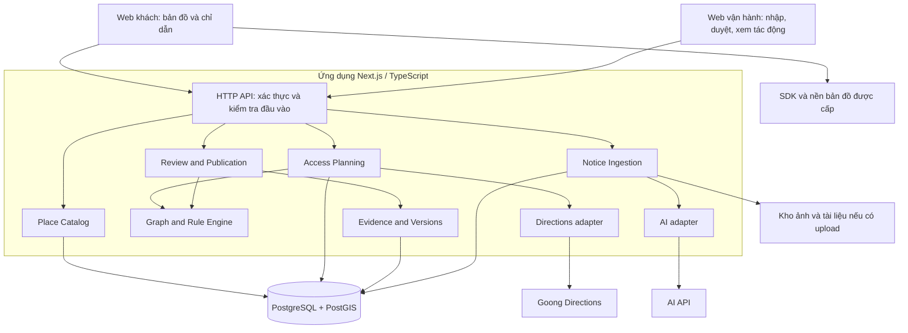

# AccessLink — Requirements và kiến trúc MVP

**Ngày:** 25/09/2026  
**Căn cứ:** `docs/product/proposal.md` v1.0 và [kịch bản mock S0–S5](../demo/mock-data.md).\
**Trạng thái:** Đề xuất kỹ thuật để nhóm triển khai; chưa phải phần mềm đã xây hoặc kết quả đã đo.  
**Quy mô thiết kế:** Nhóm 4 người; một cụm 5–10 địa điểm; web khách và web người vận hành.

## 1. Kết luận kiến trúc

Chọn **modular monolith**: một ứng dụng triển khai chung, chia các module theo nghiệp vụ. Bên trong mỗi module tách phần quy tắc nghiệp vụ khỏi HTTP, database và API ngoài.

Stack đề xuất: **Next.js + TypeScript; PostgreSQL/PostGIS; bộ tìm phương án tiếp cận viết bằng TypeScript; Goong qua adapter; AI trích xuất qua adapter phía server**. Ảnh/tài liệu đặt trong object storage nếu có chức năng tải lên.

Đây là quyết định dựa trên quy mô và nghiệp vụ AccessLink. Nó giúp nhóm dùng chung kiểu dữ liệu, chạy một luồng đầy đủ sớm và giữ các phép cập nhật liên quan trong cùng database. Chưa có nhu cầu triển khai độc lập nhiều dịch vụ. Microservices, Kafka, Neo4j, vector database và hệ thống đa tác tử không phải thành phần bắt buộc của MVP.

Next.js có Route Handlers cho HTTP API; tài liệu cũng nêu giới hạn phụ thuộc môi trường triển khai, đặc biệt với tác vụ kéo dài. Vì vậy dùng handler mỏng, xử lý ngắn có timeout; khi cần xử lý tài liệu hàng loạt thì bổ sung worker bền vững. [Tài liệu Next.js](https://nextjs.org/docs/app/guides/backend-for-frontend).

### Ràng buộc từ đề TASCO: bản đồ là phần cốt lõi

Đã đọc lại Challenge Brief ngày 25/09/2026. Đề yêu cầu lớp ứng dụng và/hoặc dữ liệu chuyên đề trên nền tảng bản đồ, có nhu cầu cụ thể tại Việt Nam; phải chứng minh bản đồ thiết yếu. Web demo cần thể hiện lớp đó trên nền bản đồ. Đây là yêu cầu trực tiếp từ đề; các quyết định giao diện và nghiệm thu bên dưới là cách AccessLink đáp ứng. [Đề TASCO](https://docs.google.com/document/d/11fRaBedWrh4XwWld9_dqoMTgj-lNi88Buzr5y3i0QOE/edit).

**Bản đồ tương tác và lớp tiếp cận có tọa độ là P0.** Goong Directions cho chặng từ xa tới cụm là hạng mục riêng, có thể làm sau khi demo nội bộ chạy ổn. Sơ đồ graph phục vụ phát triển/kiểm thử; demo bàn giao phải có lớp dữ liệu trên bản đồ. Nếu dùng nền thật với đường/cửa giả lập, ghi rõ vùng mô phỏng và không gán trạng thái chưa xác minh cho cửa hàng thật.

Vai trò bản đồ trong AccessLink có ba phần:

1. **Dữ liệu không gian:** vị trí cửa, hình học đoạn nối, vùng công trình, quan hệ giữa lối chung và từng địa điểm.
2. **Tính toán không gian và mạng đường:** xác định các kết nối hợp lệ, kiểm tra phương thức/thời gian, tìm phương án và đánh giá lại khi lối thay đổi. Khoảng cách thẳng hoặc một pin địa điểm không đủ để tính kết quả này.
3. **Tương tác trên bản đồ:** khách chọn điểm đến, xem từng chặng và đúng cửa; người vận hành chọn cửa/đoạn bị tác động, xem lớp trước–sau và xác nhận vị trí AI đề xuất.

Phép thử thiết kế: nếu thay đổi kết nối G2 với mạng tiếp cận mà kết quả vẫn giữ nguyên theo một đoạn văn viết sẵn, implementation chưa đáp ứng nghiệp vụ. Kết quả phải được suy ra từ dữ liệu không gian và graph. Bỏ lớp nền ảnh không làm mất thuật toán, nhưng bỏ vị trí, kết nối và các điều kiện gắn với chúng thì hệ thống không còn tính được phương án đúng.

## 2. Bài toán cần giải quyết

**Câu hỏi của khách:** “Với phương tiện và thời gian của tôi, tôi đến địa điểm này qua lối nào, gửi xe ở đâu nếu cần, và thông tin đó có căn cứ gì?”

**Câu hỏi của người vận hành:** “Thông báo mới làm thay đổi lối nào, ảnh hưởng địa điểm nào, và tôi công bố hướng dẫn mới bằng cách nào?”

Ba đầu ra chính:

1. Phương án đi tới đúng cửa, gồm từng chặng và điều kiện sử dụng.
2. Bản cập nhật có nguồn, người duyệt, thời gian và phiên bản.
3. So sánh trước–sau cho các địa điểm trong cụm khi điều kiện tiếp cận thay đổi.

Trạng thái hoạt động của cửa hàng và trạng thái lối tiếp cận là hai dữ liệu độc lập. A vẫn có thể đang mở khi hệ thống chưa tìm được lối đến A.

## 3. Người dùng và quyền

| Vai trò | Được làm | Giới hạn |
|---|---|---|
| Khách | Tìm địa điểm, xem phương án, xem nguồn công khai, gửi phản ánh | Không cần tài khoản để xem; không sửa trực tiếp dữ liệu công bố |
| Người đóng góp/chủ điểm | Gửi ghi chú, ảnh, thông tin địa điểm | Nội dung đi vào hàng đợi kiểm tra |
| Người vận hành | Nhập/sửa bản nháp, ghép thông báo với cửa/đoạn, xem tác động | Phải đăng nhập; chỉ thao tác trong khu vực được phân quyền |
| Người duyệt | Duyệt/công bố, từ chối, đánh dấu cần kiểm tra lại | Server kiểm tra quyền và phiên bản; lưu lịch sử |

MVP có thể cho một tài khoản nội bộ kiêm người vận hành và người duyệt; vẫn phải giữ bước duyệt riêng khỏi bước trích xuất.

## 4. Functional requirements và nghiệm thu

P0 là luồng bắt buộc; P1 là phần làm sau khi P0 chạy ổn. Đây là thứ tự triển khai đề xuất, không phải phân loại từ BTC.

| ID | Mức | Requirement | Điều kiện nghiệm thu |
|---|---|---|---|
| FR01 | P0 | Tìm và chọn địa điểm trong cụm; hỗ trợ tên/biệt danh, link trực tiếp | Tìm được các địa điểm seed; tên không có trong cụm trả kết quả rỗng rõ ràng |
| FR02 | P0 | Nhận điểm xuất phát, phương tiện, thời gian | Từ chối tọa độ/giờ không hợp lệ; thiếu định vị cho chọn điểm thủ công |
| FR03 | P0 | Hiển thị cửa, đường nối, điểm gửi xe, rào chắn và phạm vi dữ liệu | Chọn đối tượng trên bản đồ xem được chi tiết; đóng lối không xóa dấu vết hình học |
| FR04 | P0 | Tìm phương án có chặng xe máy và/hoặc đi bộ | S0 tìm đúng O→P→G2→J→A; chỉ đổi phương thức tại điểm hợp lệ |
| FR05 | P0 | Đánh giá hướng, phương tiện, thời gian và nguồn cho từng chặng | Không qua cạnh cấm; kiểm tra thời gian tại lúc đi qua; vượt qua các test ranh giới |
| FR06 | P0 | Trình bày hướng dẫn tới cửa và lý do chọn | Có chặng, cửa đích, quãng đi bộ, mốc/ảnh nếu có, nguồn và lúc kiểm tra |
| FR07 | P0 | Trả trạng thái có phương án, thiếu căn cứ hoặc chưa tìm thấy | S2/S4 không tạo tuyến giả; thông báo kèm phạm vi tìm kiếm |
| FR08 | P0 | Nhập thông báo tiếng Việt; AI đề xuất bản nháp | Các trường vị trí, giờ, chiều, phương tiện kèm đoạn nguồn; trường chưa rõ để trống |
| FR09 | P0 | Người vận hành chỉnh, xem tác động và công bố | Bản nháp chưa ảnh hưởng tuyến khách; sau duyệt có phiên bản mới |
| FR10 | P0 | Tính lại phương án trong cụm và so sánh trước–sau | S1 đổi A/B, C không đổi trong cùng truy vấn so sánh; xử lý cả lối đóng và lối mở thêm |
| FR11 | P0 | Quản lý bằng chứng, độ mới, xung đột | S4/S5 giữ nguồn, không tự mở lối chỉ vì thông tin đã cũ hoặc có một phản ánh |
| FR12 | P0 | Nhận phản ánh đơn giản | Tạo hồ sơ chờ kiểm tra; không sửa trạng thái công bố ngay |
| FR13 | P0 | Môi trường demo và đồng hồ giả lập | Reset S0–S5 có thể lặp lại; API/UI luôn mang nhãn mô phỏng |
| FR14 | P0 | API cho dữ liệu tiếp cận và phiên bản | Client độc lập đọc được địa điểm, layer và phương án; không phụ thuộc màn hình admin |
| FR15 | P1 | Upload ảnh/PDF, OCR và nhiều thông báo | Có giới hạn tệp, trạng thái xử lý, báo lỗi và nhập tay khi xử lý thất bại |
| FR16 | P1 | Lấy chặng đường ngoài cụm từ Goong | Đầu cuối thực sự nối với graph địa phương; kiểm tra hạn chế đã biết trên tuyến ngoài |
| FR17 | P1 | Công cụ vẽ/sửa mạng đường hoàn chỉnh | Sửa node/edge có kiểm tra kết nối; giai đoạn đầu dùng seed GeoJSON và form sửa đơn giản |
| FR18 | P1 | Dashboard vận hành mở rộng | Lọc bản ghi cần kiểm tra, thống kê công cập nhật, xuất dữ liệu theo quyền |
| FR19 | P0 | Web demo có nền bản đồ tương tác và lớp AccessLink theo tọa độ | Pan/zoom, chọn cửa/đoạn/địa điểm, bật/tắt lớp; đường và đối tượng căn đúng tọa độ, nhãn mô phỏng hiện rõ khi dùng fixture |
| FR20 | P0 | Duyệt vị trí bị ảnh hưởng ngay trên bản đồ | Người vận hành chọn đối tượng graph đã có, đối chiếu đoạn nguồn và xác nhận vị trí; AI không tự tạo liên kết chỉ vì cùng tên hoặc gần nhau |
| FR21 | P0 | Trình diễn thay đổi không gian trước–sau | Cùng điểm đi, phương tiện, giờ và cùng trạng thái các yếu tố còn lại: khi G2 bị đóng, bản đồ thể hiện A/B đổi lối còn C giữ tuyến; có version và giải thích |

FR16 là P1 đối với demo có điểm xuất phát trong cụm. Nếu nhóm quảng bá hành trình từ bất kỳ đâu tới cửa hàng, FR16 trở thành P0 cho phạm vi đó. FR19 luôn là P0: thứ tự tích hợp Directions không làm nền bản đồ và lớp chuyên đề trở thành tùy chọn.

## 5. Business rules phải thống nhất trước khi code

| ID | Quy tắc |
|---|---|
| BR01 | Cửa hàng mở không đồng nghĩa mọi cửa đều vào được; đóng một cửa không tự đóng cửa hàng. |
| BR02 | Chỉ các cạnh nối tường minh mới tạo đường đi. Hai đường cắt hình học hoặc hai điểm gần nhau không tự liên thông. |
| BR03 | Cấm/đóng là điều kiện loại tuyến, không phải chi phí cao mà engine có thể vượt qua. |
| BR04 | Đổi từ xe máy sang đi bộ chỉ tại node có dịch vụ nhận xe và còn đáp ứng điều kiện. Bãi hết giờ nhận xe không tự chặn đường đi bộ qua vị trí đó. |
| BR05 | Quy định được đánh giá theo phương tiện, mục đích, hướng và thời điểm đi qua. Khoảng thời gian dùng quy ước [bắt đầu, kết thúc). |
| BR06 | `valid_to = null` là chưa biết kết thúc. `review_due_at` quá hạn không làm lệnh cấm tự hết hiệu lực. |
| BR07 | Nguồn thiếu/cũ/mâu thuẫn không được chuyển thành một lối đã xác nhận. Quy định còn hiệu lực không bị một phản ánh ghi đè. |
| BR08 | AI chỉ tạo đề xuất. Công bố cần quyền người duyệt và các tham chiếu dữ liệu hợp lệ. |
| BR09 | Một kết quả tuyến dùng đúng một phiên bản dữ liệu nội bộ; có version để truy vết và tính lại. |
| BR10 | Không có kết quả trong mạng/tập ứng viên đã tìm không chứng minh ngoài thực tế hoàn toàn không có lối. |
| BR11 | Quá trình duyệt dữ liệu mock không biến nó thành dữ liệu được xác minh tại hiện trường. |
| BR12 | Mở thêm một lối cũng có thể làm tuyến tốt hơn: phải đánh giá lại cả các địa điểm chưa từng đi qua lối đó. |

### Quyết định về thời gian

Proposal nói “giờ đến” nhưng chưa tách rõ giờ xuất phát, giờ tới bãi và giờ tới cửa. Đề xuất MVP dùng **giờ xuất phát** làm đầu vào tuyến (`depart_at`), tính thời gian đi qua các điểm rồi hiển thị giờ đến ước tính. Đây là quyết định thu hẹp để nhóm xác nhận, không phải chức năng đã có.

Trong demo, tốc độ và thời gian gửi xe được cấu hình; không gọi thời gian giả lập là ETA thực tế. Chế độ tra điều kiện ở một giờ cố định có thể dùng `check_at`, nhưng kết quả phải ghi là kiểm tra trạng thái tại giờ đó. Chức năng “cần đến trước 18:00” là một bài toán khác, để giai đoạn sau. Không dùng `arrival_time` và `depart_at` thay thế lẫn nhau.

## 6. Non-functional requirements

Các ngưỡng dưới đây là mục tiêu kiểm thử đề xuất, chưa được đo.

| ID | Requirement | Cách kiểm tra |
|---|---|---|
| NFR01 | Tính đúng có thể lặp lại | Cùng dataset version, truy vấn và đồng hồ cho cùng kết quả; thứ tự hòa điểm ổn định |
| NFR02 | Phản hồi nhanh trên mạng demo | Local route API p95 dưới 1 giây với 10 truy vấn đồng thời trên fixture; ghi cấu hình máy, số mẫu; không gộp độ trễ Goong/AI |
| NFR03 | Cập nhật nhất quán | Không trộn node/rule giữa hai phiên bản; hai người duyệt cùng bản cũ không ghi đè nhau |
| NFR04 | UX điện thoại | Hoàn tất tìm–chọn–xem chặng ở màn hình rộng 360 px; trạng thái có chữ, không chỉ màu |
| NFR05 | Truy vết | Lưu người duyệt, nguồn, version trước/sau; route trả version và lý do loại/chọn phù hợp |
| NFR06 | Phân quyền và dữ liệu đầu vào | Ghi/công bố kiểm tra quyền server; API key bí mật ở server; validate ID, thời gian và payload AI |
| NFR07 | Hoạt động khi dịch vụ ngoài lỗi | AI lỗi vẫn nhập tay; Goong lỗi vẫn dùng demo nội bộ có nhãn; không trả đường ngoài cụm tự bịa |
| NFR08 | Khả năng kiểm thử | Engine không phụ thuộc UI/Goong/LLM; có fixture, clock và adapter thay thế |
| NFR09 | Độ mới của kết quả | Tính lại khi người dùng truy vấn, version đổi hoặc chạm mốc điều kiện thời gian; không cache tuyến chỉ theo place ID |

## 7. Sơ đồ kiến trúc



Một ứng dụng server có thể phục vụ cả hai giao diện. Hai giao diện có quyền khác nhau. Database là nguồn dữ liệu công bố; frontend không tự tính quy tắc riêng để quyết định lối được phép đi.

### Các module và trách nhiệm

| Module | Chịu trách nhiệm | Không ôm thêm |
|---|---|---|
| Place Catalog | Địa điểm, tên, giờ hoạt động, link | Không tự tính đường |
| Access Planning | Điều phối truy vấn, lấy graph, chặng ngoài, tạo AccessPlan | Không đọc nội dung thông báo bằng AI trong lúc tìm đường |
| Graph and Rule Engine | Kết nối, phương thức, thời gian, điều kiện, xếp hạng | Không gọi HTTP/database trực tiếp |
| Notice Ingestion | Văn bản nguồn, trích xuất, kết quả nháp | Không công bố quy định |
| Review and Publication | Sửa nháp, kiểm tra, xem tác động, công bố version | Không ghi từng rule trực tiếp vào trạng thái live trước khi duyệt |
| Evidence and Versions | Nguồn, độ mới, lịch sử, snapshot | Không coi LLM confidence là xác minh hiện trường |

Gợi ý cấu trúc mã:

```text
src/
  app/                     # Trang khách, admin, route handlers
  modules/
    places/
    access-planning/
    notice-ingestion/
    review-publication/
    evidence/
  core/
    graph/                 # Node, edge, search, mode transitions
    rules/                 # Điều kiện và lý do đánh giá
    time/                  # Clock, lịch hoạt động, khoảng hiệu lực
  infrastructure/
    db/
    maps/                  # Goong adapter, fixture adapter
    ai/                    # Extractor và validator
    storage/
  contracts/               # Request/response, validation schemas
data/
  demo/                    # JSON/GeoJSON xuất từ bộ sinh
src/demo/                  # Mã TypeScript tạo dữ liệu và đáp án mẫu
```

Route handler gọi use case trong module; use case gọi engine và các adapter. Khi cần tách API khỏi Next.js sau này, phần engine và use case có thể giữ lại.

**Bố trí thư mục thực tế (04/10/2026):** xem [cấu trúc repository](repository-layout.md). Cây trên vẫn liệt kê cả các module dự kiến chưa triển khai; không tạo thư mục rỗng chỉ để khớp thiết kế.

## 8. Kiến trúc dữ liệu

Giữ các thực thể trong proposal: `Place`, `PlaceOperation`, `AccessNode`, `AccessEdge`, `WorkZone`, `AccessRule`, `Evidence`, `ChangeSet`. `AccessPlan` là kết quả tính toán; không bắt buộc lưu mọi truy vấn của khách.

Bổ sung:

| Thành phần | Mục đích |
|---|---|
| `Dataset` | Một khu dữ liệu; có môi trường demo/pilot và con trỏ phiên bản công bố hiện tại |
| `DatasetVersion` | Snapshot nội bộ bất biến, có thời điểm công bố và ChangeSet tạo ra nó |
| `Report` | Phản ánh chờ kiểm tra, nguồn và các đối tượng liên quan |
| `TransferRule` | Điều kiện chuyển phương thức tại P: giờ nhận xe, loại xe, thời gian chuyển |
| `AuditEntry` | Ai sửa/duyệt, hành động nào, trước và sau |

MVP có thể lưu snapshot graph/rules/evidence đã chuẩn hóa trong JSONB của `DatasetVersion`; lưu metadata địa điểm/khu vực có geometry để truy vấn bản đồ. Mỗi lần công bố sao chép snapshot nhỏ rồi áp dụng thay đổi; không trộn bản nháp vào snapshot cũ. Nội dung version phải đủ để tính tuyến và kiểm tra nguồn tại thời điểm truy vấn. Dữ liệu geometry phục vụ hiển thị theo version phải lấy từ cùng snapshot hoặc bản chiếu được gắn version tương ứng.

Khi dữ liệu lớn, chuyển sang các bảng node/edge/rule có revision và spatial index; vẫn giữ hợp đồng snapshot. Không cần dùng hai cách lưu song song ngay từ MVP.

PostGIS dùng cho tìm đối tượng theo vùng/khoảng cách và xác định ứng viên bị ảnh hưởng. `ST_DWithin` với geography dùng đơn vị mét và có thể tận dụng spatial index. Truy vấn gần nhau chỉ tìm ứng viên; kết nối đường vẫn do graph quyết định. [Tài liệu PostGIS](https://postgis.net/docs/ST_DWithin.html).

## 9. Thiết kế engine tìm phương án

### Đầu vào và đầu ra

Đầu vào gồm `dataset_id`, điểm xuất phát hoặc node đã xác định, `place_id`, `mode`, `depart_at`, `purpose`. API trả `data_version`, phương án từng chặng, khoảng cách, thời gian giả định/ước tính, nguồn, lý do và phạm vi tính toán.

Tách hai chiều trạng thái:

- `route_status`: `available`, `needs_verification`, `no_plan_found`.
- `data_kind`: `simulated` hoặc `field`; thông tin xác minh trả riêng.

Nhờ đó một tuyến chạy đúng trong mock vẫn có `data_kind=simulated`, không bị gọi nhầm là tuyến đã xác minh ngoài thực tế.

### Graph phương thức

Tìm trên trạng thái `(node_id, travel_mode, parked_at)`. Người đi xe máy chuyển sang đi bộ tại P khi TransferRule cho phép; người đi bộ từ đầu không cần gửi xe. MVP hành trình một chiều không hỗ trợ tự lấy lại xe tại một P khác.

Tính chi phí từ thời gian từng cạnh và thời gian chuyển phương thức; có thể xếp hạng tổng thời gian trước, quãng đi bộ sau. Mọi tốc độ/thời gian mô phỏng là cấu hình được công bố. Điều kiện cấm được kiểm tra trước xếp hạng.

### Tìm đường theo thời gian

Dijkstra trên graph trạng thái cố định phù hợp với tình huống không đổi quy tắc trong suốt chuyến đi. Nếu giờ mở/đóng thay đổi trong lúc đi, chỉ kiểm tra ở giờ xuất phát là sai.

Đề xuất MVP: sinh tập đường ứng viên trên graph nhỏ, mô phỏng thời gian đi qua từng cạnh/điểm chuyển, kiểm tra điều kiện rồi chọn phương án hợp lệ. Giới hạn số ứng viên và thời gian tìm kiếm; trả `search_scope`/giới hạn để không tuyên bố tối ưu toàn mạng. Bộ mock nhỏ có thể duyệt toàn bộ đường đơn trên graph trạng thái cho các test; không dùng duyệt toàn bộ đường đơn cho mạng lớn.

Nếu một ứng viên thất bại ở ranh giới giờ, phải thử ứng viên tiếp theo. Giới hạn ứng viên có thể bỏ sót một lối hợp lệ; khi đạt giới hạn cần ghi lý do rõ. Tối ưu cho phép chờ, tuyến vòng để chờ và “đến trước giờ hẹn” chưa nằm trong MVP.

### Ghép Goong với mạng địa phương

Goong cung cấp chặng đến một điểm nối hợp lệ; AccessLink xử lý phần tiếp cận tới cửa. Kiểm tra điểm cuối chặng ngoài, hướng và điều kiện nối. Hình học tuyến ngoài phải được đối chiếu với các hạn chế đã biết; nếu chưa xác minh được đoạn giao cắt, không gắn nhãn toàn hành trình đã xác nhận.

Tài liệu Goong Directions V2 có tuyến thay thế, geometry và duration; mô tả phương tiện ở phần giới thiệu và bảng tham số chưa nhất quán. Phải thử API key thực và xác nhận mã xe máy. Không suy ra Goong hỗ trợ graph tự bổ sung hay mọi ràng buộc giờ từ API Directions. [Tài liệu Goong](https://help.goong.io/kb/rest-api-v2/directions-rest-api-v2/directions-v2/).

## 10. Luồng công bố và tính lại tác động

1. AI hoặc người vận hành tạo bản nháp gắn `base_version` và bằng chứng.
2. Validator kiểm tra node/edge tồn tại, thời gian, phương tiện và các trường bắt buộc.
3. Tạo snapshot dự kiến; chạy cùng bộ truy vấn đại diện trên bản cũ và bản dự kiến.
4. Hiển thị khác biệt theo địa điểm, phương tiện và thời gian; ghi rõ đây là những truy vấn đã kiểm tra.
5. Người duyệt xác nhận. Trong transaction, khóa dòng dataset, kiểm tra lại `base_version`, ghi version mới, audit và đổi con trỏ phiên bản hiện tại.
6. Nếu phiên bản nền đã đổi, từ chối với conflict và yêu cầu xem lại bản diff mới. Nếu bấm công bố lại cùng ChangeSet, trả kết quả cũ, không tạo phiên bản trùng.
7. Client kiểm tra version bằng polling ngắn hoặc refetch khi có thao tác; version đổi thì tính lại truy vấn đang xem. Mốc giờ hiệu lực cũng kích hoạt tính lại dù không có version mới.

**MVP tính lại toàn bộ 5–10 địa điểm trong các ngữ cảnh demo đã định.** Chỉ tìm những tuyến cũ đi qua cạnh đổi sẽ bỏ sót tác động của lối mở thêm. Khi hiển thị “A/B bị ảnh hưởng”, luôn gắn phương tiện/giờ so sánh; không suy rộng cho mọi thời điểm.

Snapshot bất biến cho phép đọc version một lần rồi dùng xuyên suốt truy vấn. Việc giữ một transaction không tự bảo đảm mọi SELECT thấy cùng snapshot ở mức Read Committed; kiến trúc này dựa vào version bất biến và khóa khi công bố. [PostgreSQL transaction isolation](https://www.postgresql.org/docs/current/transaction-iso.html).

MVP không cần cache kết quả route để tránh lỗi giờ/phiên bản. Cache snapshot bất biến theo version nếu cần. Khi có bằng chứng độ trễ thực tế mới thêm cache route với key đầy đủ và thời hạn tới mốc điều kiện gần nhất.

## 11. API đề xuất

| Endpoint | Chức năng |
|---|---|
| `GET /api/v1/places?dataset_id=...&q=...` | Tìm địa điểm trong cụm |
| `GET /api/v1/places/{id}` | Chi tiết địa điểm |
| `GET /api/v1/access-layer?dataset_id=...&version=...&bbox=...` | Layer thống nhất theo version |
| `POST /api/v1/access-plans` | Điểm đi, đích, phương tiện, depart_at; trả phương án và nguồn |
| `POST /api/v1/reports` | Tạo phản ánh chờ kiểm tra |
| `POST /api/v1/admin/notices/extract` | Trích xuất có timeout, trả bản nháp và đoạn nguồn |
| `PATCH /api/v1/admin/changesets/{id}` | Sửa bản nháp |
| `POST /api/v1/admin/changesets/{id}/preview` | Xem tác động trên bộ truy vấn cụ thể |
| `POST /api/v1/admin/changesets/{id}/publish` | Công bố với base_version và khóa chống lặp |
| `GET /api/v1/datasets/{id}/version` | Client kiểm tra version hiện tại |

Đây là hợp đồng đề xuất của AccessLink. Không phải API do TASCO đã cấp. Schema request/response dùng chung để frontend và backend không tự diễn giải khác nhau.

## 12. Thứ tự triển khai và nghiệm thu cuối

1. **Graph + fixtures trước:** load S0, trả phương án thật từ engine, chưa cần AI.
2. **Luồng khách:** tìm A, chọn phương thức/giờ, xem map và từng chặng.
3. **Cập nhật thủ công:** sửa rule, preview, duyệt, tăng version, A/B thay đổi đúng.
4. **AI hỗ trợ nhập:** ghép vào luồng bản nháp đã hoạt động; giữ nhập tay khi AI lỗi.
5. **Biên và trạng thái thiếu:** S2–S5, giờ ranh giới, xung đột, hai lần duyệt đồng thời.
6. **Tích hợp ngoài:** Goong chặng ngoài, upload ảnh, cải thiện UI sau khi lõi ổn định.

Các test có giá trị nhất:

- S0–S5 đúng kỳ vọng trong tài liệu mock.
- Đóng một chiều không chặn nhầm chiều ngược; luật ô tô không tự áp xe máy.
- 19:59 xuất phát nhưng tới bãi sau 20:00 thì không được nhận xe.
- Mở thêm lối ngắn hơn khiến hệ thống phát hiện phương án mới.
- Hết hạn bằng chứng cho phép đi không mở lại một lệnh cấm.
- Thiếu origin hợp lệ không tự snap qua tường/rào.
- Hai người công bố dựa trên cùng version: chỉ một cập nhật thắng, người còn lại thấy conflict.
- Bản nháp AI sai ID/thiếu giờ không làm thay đổi layer công bố.
- Thay đổi theo giờ làm tuyến cập nhật ngay cả khi data version giữ nguyên.
- Khách không đăng nhập không gọi được endpoint duyệt/công bố.

**Definition of Done cho MVP:** người xem thực hiện được luồng chọn địa điểm → nhận phương án → duyệt một thay đổi → thấy tuyến và danh sách tác động đổi đúng; mọi kết quả truy được nguồn/version; các trường hợp thiếu lối, sai giờ và dữ liệu chưa xác minh trả đúng trạng thái.

## 13. Những điểm cần chốt khi bắt đầu code

Các mặc định đề xuất để nhóm có thể bắt đầu ngay:

- Đầu vào thời gian là giờ xuất phát; hỗ trợ giờ hẹn ở giai đoạn sau.
- Ưu tiên tìm trong cụm trước; không cam kết dẫn đường toàn thành phố.
- Một lượt đi; chưa tối ưu giờ lấy xe và lượt về.
- Mỗi cụm có một người vận hành demo; tất cả thao tác ghi vẫn kiểm tra quyền.
- Dữ liệu fixture đi qua cùng engine và luồng duyệt như dữ liệu pilot sau này.
- Bộ scenario kiểm tra tác động theo ngữ cảnh cố định, không gắn “toàn bộ thời gian” vào kết quả.

Mục tiêu của kiến trúc là giữ phần quyết định đường đi đúng, kiểm tra được và có thể tích hợp. Mở rộng hạ tầng dựa trên số đo tải, độ trễ và công vận hành sau MVP.
